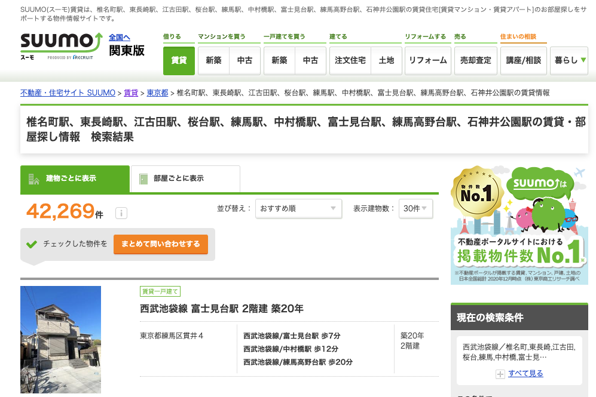

# Rとはなにか？ {#whatsr}


## R?

- 　**R** は統計、データ分析、作図のためのインタープリタープログラミング言語

- 統計やデータ分析を行うアプリ
  - 他にはSPSS, Stata
  - Pythonもよく使われる

## Excelじゃだめなのか

- **Excel** は表計算ソフトで多くの機能を有している

- Excelでできること
  - 計算する
  - 図を描く
  - 基本的な統計分析

- ではExcelではだめなのか？
  - Excelでも最低限のことはできますが、分析が複雑になっていくと手数も増えていきます。
  - 特に、Excelだと同じことをもう一度やる（データを変えて同じ分析をする、など）がやりにくく、ミスも起きやすくなります。
  - 本当に初歩の初歩ならエクセルで十分ですが、ある程度の実証分析をやろうと思うとRなどを学ぶほうが回り道のようで結局早い

```{r, label = complexity, echo = FALSE, fig.align = "center", fig.cap = "", fig.width = 12,fig.height = 7}
data.frame(complexity = seq(0,5,by=0.1)) %>%
  mutate(
       R = 25+5*complexity - 0.2*complexity^2,
       Excel = exp(complexity)) %>%
ggplot(aes(x=complexity)) + 
  geom_line(aes(y=R),col="blue",size=2) +
  geom_line(aes(y=Excel),col="forestgreen",size=2) +
  annotate("text",x=4.5,y=55,label="R",col="blue",size=10) +
  annotate("text",x=4.5,y=130,label="Excel",col="forestgreen",size=10) + 
  labs(x="分析の複雑さや高度さ",y="作業の複雑さや大変さ") +
  theme_bw(base_family="HiraKakuPro-W3") +
  theme(panel.grid = element_blank(),
        panel.border = element_blank(),
        axis.line=element_line(color="black"),
        axis.title = element_text(size=20),
        axis.ticks = element_blank(),
        axis.text = element_blank()) 
```


## Rのよいところ

- 無料
- 多くにプラットフォーム（MacOS, Windows, Linux)で使用可能
- たくさんの資料がネット上に存在する
- 分析結果をプレゼンテーションするツールが充実している
 - Rstudio: 統合開発環境(IDE)
- 豊富なパッケージ
  - 多くのエンジニアや研究者が公開
  


## 例えばRでできること：図表

Rでは、柔軟に図表を描くことができます。例えば以下の図は、武蔵大学のウェブサイトに公開されている学生数のデータを描画したものです。少しやり方を学べば、以下のような図を簡単に作成することができます。

```{r, echo =FALSE}
data_634_long = read_csv("data/musashi_keizai_students_2025.csv") %>%
  pivot_longer(cols=c("1年","2年","3年","4年"),names_to ="学年",values_to = "学生数") %>%
  mutate(学科 = factor(学科, levels=c("経済学科","経営学科","金融学科")),　## order of departments
         性別 = factor(性別, levels=c("男","女")),
         学年 = factor(学年, levels=c("1年","2年","3年","4年")))
```


```{r label = musashi1, echo = FALSE, fig.align = "center", fig.cap = "", fig.width = 10,fig.height = 6}
fig_musashi_students <- ggplot(data_634_long, aes(x=`学年`,y=`学生数`, fill=`性別`)) +
  geom_bar(stat="identity",position="dodge") +
  scale_fill_manual(values =c("#0A6648","#F6B21B")) +
  labs(fill="",x="",y="",
       title="武蔵大学経済学部の学科別・男女別学生数",
       subtitle="2023年5月1日時点") +
  facet_wrap(~`学科`) +
  theme_minimal(base_family="HiraKakuPro-W3") +
  theme(panel.grid.major.x = element_blank(),
        legend.position = "bottom",
        text = element_text(size=15))

fig_musashi_students
```


## 例えばRでできること：ウェブアプリ

Rではインタラクティブなウェブアプリも作ることができます。以下の例は、数値をユーザーが変えることで結果のグラフが変化して表示される簡単なウェブアプリです。

 [例](https://keita43a.shinyapps.io/easter_island/)


## 例えばRでできること：ウェブスクレイピング


```{r  label = suumo1, echo = FALSE, fig.align = "center", fig.cap = "", out.width = '80%'}


# suumo_repで中身を見せられる
```


## 地図の分析・活用


```{r, echo=FALSE, out.width='100%', fig.height=6}
library(leaflet)
leaflet() %>% addTiles() %>% setView(lat = 35.7366, lng = 139.6673, zoom = 17)
```


## Rの欠点

- Rは進化が速い
- 処理が比較的遅い
  - 一般的なデータ分析をするのには問題がない
  - Excelよりは速い
  - ビッグデータや複雑な統計モデルを走らせると、遅かったりメモリ消費が激しい
- CUIなので、最初の学習が難しい
  


## CUIとGUI

- CUI: Character User Interface
  - 命令を文字で行う（キーボードを使う）操作環境

- GUI: Graphic User Interface
  - マウスでクリックしながら使う操作環境


### GUIの方が楽？

- GUIの方が楽では？
  - マウスで操作ができる方がよさそう？

- CUIは記録ができる
  - 何度も同じ操作ができる
  - 人が書いた一連の操作（コード）をコピー・参考にできる
  - 柔軟性が高い
  
- Rを使う統合環境であるRStudioは、CUIながらGUI的に作業を行える部分もある環境を提供する。


## プログラミング

- やることはプログラミング
- PythonもJavaも、まずはプログラミングを理解すると学べるようになる
- Rは比較的わかりやすい言語
- ゼミでは基本的なデータ描画と統計分析をできるようになることが目標

