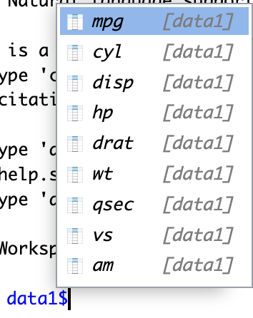

# Rのはじめかた {#howtostart}

## Rをどうやって使う？

- Rを使うにはいくつか方法がある。
- 統合開発環境 IDE: Integrated Development Environment
  - ソフトウェア開発や、データ分析のプロセスをワンストップで行える環境
  - 一部GUIを導入したり、CUIによる操作をアシストする
- 特に強い好みがない限り、**Rstudio**をおすすめ
  - R 単体でも使えるが、RstudioでRを使うほうが直感的で使いやすい。


## Rstudioを使う3つの方法

1. PCにインストール
  - 自分のPCにインストール
  - ネット環境がなくても使える
  - 自分のPCにファイルにアクセスして使える
  
2. 学校のパソコンを使う
  - 学校のパソコンにはRとRStudioがインストールされている
  - 学校に自分のPCを持ってこなくてもよいが家で勉強できない
  - Rプロジェクトを用いた際にネットワークドライブに置いた場合、ワーキングディレクトリの挙動がおかしいので、パソコンのpathなどに詳しくない人は混乱するかもしれない。

3. posit.Cloudの無料プランを使う
  - クラウド上でRstudioを使う
  - 利点：コンピューター上の設定が不要
  - 欠点：データファイルなどを毎回アップロードする必要がある。ファイル数などは限られる。
  
できれば1の方法でやってみよう。


## Rのインストール

- 学校のパソコンにはすでにインストールされている
- 自分のパソコンに導入する人は[このスライド](https://speakerdeck.com/s_uryu/introduction-to-r)か[ここ](https://yukiyanai.github.io/jp/resources/)にある「RとRStudioのインストール方法の解説」を参照

### Windownsへのインストール

- ブラウザから<a href="https://cran.ism.ac.jp/" target="_blank">CLAN</a>へアクセスする
  - もし繋がらなければ<a href="https://ftp.yz.yamagata-u.ac.jp/pub/cran/">こちら</a>から試してみる
- 「Download R for Windows」-> 「base」-> 「Download R-4.3.3 for Windows」
  - R-4.3.3-win.exeがダウンロードされる
  - この資料が更新されていなければ4.3.3.より新しいバージョンになっているかもしれない。

```{r  label = downloadwin, echo = FALSE, fig.cap = "Rのダウンロード。Windowsの場合", out.width = '60%'}
knitr::include_graphics("fig/download_R.png")
knitr::include_graphics("fig/download_R_win.png")
knitr::include_graphics("fig/download_R_win2.png")
```

- R-4.3.3-win.exeをクリックしてインストールする
  - 基本的に「はい」や「次へ」で良い
  - 「起動時オプション」は「いいえ」（デフォルト状態）
  - 「このアプリがデバイスに変更を加えることを許可しますか」と出たら「はい」
- 完了したらデスクトップやアプリ一覧にR.4.3.3があるかどうかチェック

### Mac OSへのインストール

Mac OSへのインストールは少し大変である。一つずつ確認していこう。

#### チップの種類を確認

- まず自分のMacがIntelチップかApple Siliconかを確認する
- 左上のリンゴマーク→「このMacについて」
  - 表示された情報の「チップ」が「Apple M1」やM2,M3であればApple silicon, IntelであればIntel

#### Command Line Toolsのインストール

Macのアプリ一覧から、「ターミナル」を開く。

```{r  label = terminal, echo = FALSE, fig.cap = "ターミナル", out.width = '70%'}
knitr::include_graphics("fig/terminal_app.png")
```


ターミナルを開くと以下のような画面が出てくる。以下の画面は私のPCなのでkeitaになっているが、実際にはそれぞれのユーザーネームになっている。

```{r  label = terminalscreen, echo = FALSE, fig.cap = "ターミナルの画面", out.width = '70%'}
knitr::include_graphics("fig/terminal.png")
```

ターミナルで自分のユーザー名の隣の$マークの後ろに以下のように入力する。

```
$ xcode-select --install
```

もし\$マークがなくて、%になっていたら、%のあとに`xcode`から始めて入力する。

```
% xcode-select --install
```

あとは指示に従う。

もし`error: command line tools are already installed, use "Software Update" to install updates`というメッセージが出たらCommand Line Toolsはすでにインストールされている。

もしこれで、うまくいかない場合は次のXcodeをインストールすることでCommand Line Toolsをインストールする。

#### Xcodeのインストール

Xcodeは上のCommand Line Toolsがインストールできればとりあえず不要（のはず）である。もしできばければ、インストールしよう。ここではApple IDが必要となる。Xcodeは非常に大きいので、WiFiなどのインターネット接続が安定しているところで、**時間のあるとき**にやりましょう。

MacのApp Storeから、Xcodeをインストールする。

App Storeを開いて、Xcodeを検索する。下のようなハンマーのアイコンのアプリである。これをインストールする。


```{r label = xcode, echo = FALSE, fig.cap = "Xcode", out.width = '70%'}

```

App Storeの使い方がわからない人は、<a href="https://support.apple.com/ja-jp/guide/app-store/fir9b2ea074e/3.0/mac/10.15" target="_blank">App Storeユーザーガイド</a>を参照してください。

#### XQuartzのインストール

XQuartzの<a href="https://www.xquartz.org/" target="_blank">ウェブサイト</a>にアクセスして、`Quartz-x.x.x.pkg`というファイルをダウンロードする。`x`にはバージョン名が入るので、2024年4月時点では2.8.5だが、それより新しいバージョンになっているかもしれない。

```{r  label = xquartz, echo = FALSE, fig.cap = "XQuartzのダウンロード画面", out.width = '60%'}

```

ダウンロードされた`pkg`ファイルを開いて、インストールする。

#### Rのダウンロード

- ブラウザから<a href="https://cran.ism.ac.jp/" target="_blank">CLAN</a>へアクセスする
  - もし繋がらなければ<a href="https://ftp.yz.yamagata-u.ac.jp/pub/cran/">こちら</a>から試してみる
- 「Download R for Mac OS」をクリック
  - Apple Siliconの場合は、R-4.3.3-arm64.pkgをダウンロード
  - Intelの場合は、R-4.3.3-x86_64.pkgをダウンロード

```{r label = downloadmac, echo = FALSE, fig.cap = "Rのダウンロード。MacOSの場合", out.width = '80%'}
knitr::include_graphics("fig/download_R.png")

```
  
  
- ダウンロードしたpkgファイルをクリックしてインストールする
  - 基本的には「次へ」「同意する」を押す
  - インストール先：Macintosh HD
  - 標準インストール
- 完了したら、アプリ一覧にRがあるかどうかチェック

```{r  label = launchpad, echo = FALSE, fig.cap = "MacのLaunchpad上に表示されているR", out.width = '70%'}

```

## Rstudioのインストール

<a href="https://posit.co/download/rstudio-desktop/" target="_blank">Posit社のウェブサイト</a>へアクセス

"2. Install RStudio"の青いボタンをクリック

```{r  label = rstudioinstall, echo = FALSE, fig.align='center',fig.cap = "RStudioのダウンロード。図はMacOSの場合", out.width = '50%'}

```

ダウンロードされたファイルをクリックしてインストールする。基本的に「次へ」でよい。

完了したら、アプリ一覧に丸いロゴでRと書いてあるRStudioがあるかチェック。Windowsの場合はデスクトップにショートカットが生成されない可能性があるので、アプリ一覧でチェックしよう。


## Rstudioのインターフェース

RStudioは４つのペーンに分割されている。もし３つしかない、という人は左上の白い四角に緑の＋マークが付いているところを押して"R Script"を選ぼう。すると左上のペーンが現れて新たなスクリプトファイルが生成される。

```{r  label = rstudio2, echo = FALSE, fig.cap = "Rstudio見た目", out.width = '90%'}
knitr::include_graphics("docs/r_basics/fig/Rstudio_look-2.png")
```


## コンピュータのディレクトリ構造

コンピュータでファイルなどを扱う上で、pathという概念を理解しておく必要がある。パソコンを使っているとフォルダをよく使う。自分が作ったファイルをフォルダに保存するなどである。これはCUIでは**ディレクトリ**と呼ばれる。

コンピュータ上においては、ファイルの場所はpathで表現される。これはコンピュータ上の住所のようなものである。

`j:`というドライブの下の`abezemi`というフォルダの下にある`r_renshu`というフォルダにある`kadai1.R`というファイルがあるとする。そのファイルのpathは`j:/abezemi/r_renshu/kadai1.R`となる。

コンピュータ上では、このように文字でファイルの場所と名前を指定することがよくある。

```{r  label = directory, echo = FALSE, fig.cap = "ディレクトリ構造", out.width = '90%'}

```


## **演習**：作業フォルダを作ろう

- (Windows) ドライブ上で右クリック→新規作成→フォルダ
- (Mac) Finderの右上の◯に…のマークをクリック→新規フォルダ

### 自分のパソコン
  - 例えば「ドキュメント」(Windows)や「書類」(Mac)の下にabezemiフォルダを作成
  
### 学校のパソコン
  - 自分の学生番号のドライブ(例 s1234567)の下に abezemi フォルダを作成

### Posit.cloud
  - Posit.clouの場合は、まだここでは何もする必要はない。

## 作業スペース

コンピューター上では、どこかのディレクトリ（フォルダ）がRの作業場所になっている。
今の作業場所は`getwd()`で表示できる。

```{r, eval=FALSE}
getwd()
```

これを変更するには`setwd(path)`で変更できる。

```{r,eval=FALSE}
# Windowsの場合 
# keitaを自分のユーザー名に変える
setwd("C:/keita/Documents/abezemi")

# Mac OSの場合
# keitaを自分のユーザー名に変える
setwd("/Users/keita/Documents/abezemi")

# 学校のPCの場合
setwd("j:/abezemi")
```

ここでは`j:`ドライブの下の`abezemi`フォルダに設定。
もう一度`getwd()`して変更されたか確認しよう。


## プロジェクトの作成

作業場所を指定しても、ファイルの管理が面倒だったりする。

RStudioの**Rプロジェクト**という機能を使うと、以下のメリットがある

- データやスクリプト（コード）へのアクセスが容易
- Gitによるバージョン管理のベースにもなる
- 異なる環境でも同じ作業スペースが設定される
- 一つのプロジェクトについてひとまとまりのファイルとして管理できる


## **演習**: Rプロジェクトを作成してみよう

- File -> "New Project"
  -もしくは右上の "Project (none)"

- New Directoryでプロジェクトを作成

- "New Project"を選択

- プロジェクト名を入力: r_renshu
   - プロジェクト名は英語で。
   - 日本語は使えない（もしくはトラブルの元になる）
   - スペースも使わない。アンダーバーやハイフンを代用できる。
   
- 2つ目の欄には、どのディレクトリの下にプロジェクトディレクトリを作るかを指定する。
    - 今回はabezemiの下につくるので、Browseを開いて上で作ったabezemiフォルダを指定してOpenをクリック。

 
```{r  label = projectmake, echo = FALSE, fig.cap = "Rプロジェクトの作成", out.width = '90%'}
knitr::include_graphics("fig/r_project_make.png")
```


- プロジェクトが作成されると、作成したディレクトリにはプロジェクト名.Rprojという名前のファイルが作成される
 - 今回はabezemiの下にr_renshuフォルダが作成され、r_renshu.Rprojというファイルができる
- プロジェクトの設定などを保存

## とりあえず触ってみる

Rとの"対話"は、Rstudioの左下のペイン(コンソール)で行われる。
コンソールに、`1+1`と打ってみる。
すると、`2`と表示される。

```{r}
1 + 1
```

## スクリプトの作成 {#scriptmake}

そのままConsoleに入力していってもよいが、**スクリプト**(コード)に書くことで、記録を残しながらRに命令を与えることができる。

### **演習**：スクリプトを作成してみる

1. Rスクリプトを作成する
  - 上のメニューのFile -> New File -> R script
  - もしくは左上の区画のから、「R Script」
2. "Untitled1"というRスクリプトが作成されるので名前をつけて保存する
  - File -> Save As... -> `r_renshu.R`という名前をつけて保存
  - もしくは右上のフロッピーを押して`r_renshu.R`という名前をつけて保存 


## 実行してみる

R scriptに以下のように書く

```{r}
print("Hello World!")
```

カーソルが同じ行にあることを確認して、をクリック  
もしくは、[Ctrl]を押しながら[Enter] (MacならCommand+Enter)

"Hello World!"と表示されれば成功。

### コードを実行する際のポイント

実行したい範囲を選択してRunを押すと実行されるが、[Ctrl]を押しながら[Enter] (Macなら[Command]+[Enter])でも実行される。

また、範囲を選択しなくてもカーソルがあるところでRunか[Ctrl]+[Enter]を押すと、その行だけ（もしくはコードとして一つの命令になっている行数だけ）実行される。いちいち範囲選択しなくても良いので便利。

## スクリプトを書く際の注意点

### コメント

R script上では\#から始まる行は、コメントとして認識され、実行するとコンソールには表示されるが、何も起こらない。  
メモなどを書く際に使う。

```{r}
# これは初めてのRのコードです。
print("Hello World")
```

もしくは一度使ったが、今は実行したくないコードを一時的に無効にする。これはコメントアウトというプログラミングにおける基本的なテクニック。

```{r}
# print("Good Evening")
```


### スクリプトは読みやすく

コメントや改行を活用して読みやすいコード（スクリプト）を書く。
Rのコードでは空行は意味をなさないのでいくらでも空けてよい。

**良い例**

```{r, eval=FALSE}
# Rの練習１
# 2024年4月15日

#  ライブラリ 
library(tidyverse)

#  コード本体 
# はじめまして
print("Hello World!")

# 足し算
x <- 1 + 1

# データを読み込む
# このデータはXXでダウンロードした
data <- read_csv("data/data1.csv")


```


**良くない例**


```{r, eval=FALSE}

library(tidyverse)
print("Hello World!")
x <- 1 + 1
data <- read_csv("data/data1.csv")

```


## エラーを恐れるな！

- 間違ったコマンドを入力すると赤字でエラーが出る。
- 怖がらなくてよい。間違ってると教えてくれてるだけ。
- .(ドット)と,(コンマ)を間違えただけでもうまくいかないのがプログラミング。注意深く書こう。

```{r, error=TRUE}
# これは間違ったコード(tを忘れてる)
prin("Hello World")
```


### よくあるエラー1

`Error in read_csv("data/Countries.csv") :
could not find function "read_csv"`

`XXX`という関数が見つかりません、というエラー

**考えられるケース**

- `library()`で必要なパッケージを読み込めてない
- 関数のつづりが間違っている


### よくあるエラー2


`Error: 'data/Countris.csv' does not exist in current working directory`

XXX.csvというファイルが作業場所にありません。

**考えられるケース**
- そもそもファイルがない（保存した場所を間違えた）
- ファイルの指定場所が間違っている
- つづりが間違っている


## Rstudioの補完機能

オブジェクト内の要素や、ファイル名などを補完してくれる機能

```{r  label = hokan, echo = FALSE, fig.cap = "", out.width = '30%',fig.align='center'}

```


## Rstudioのオプション

Rstudioを自分好みにカスタマイズすることが可能  
[Tools]->[Global Options...]

- Rstudio全般
- コーディング
- 外観
- ターミナル
- キーボードショートカット


### 例：外観の変更

```{r  label = option, echo = FALSE, fig.cap = "", out.width = '60%'}
knitr::include_graphics("docs/r_basics/fig/option.png")
```
