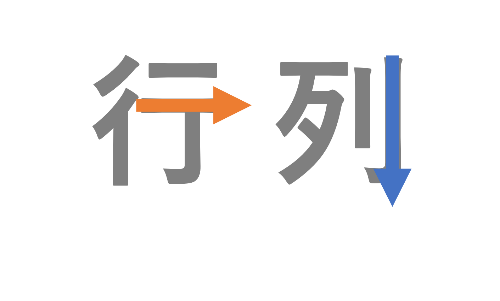

# データのハンドリング {#datahandling}


## データ

- Rはデータ分析（統計解析）を行うのが主な機能
  - それ以外も色々できるが…


### データとは？

- 構造化データと非構造化データ
  - 構造化：定義済みの形式に整理されている（行列で定義できる）
  - 非構造化：形式化が難しい（テキストデータ、音声データなど）
  - 半構造化データ：ある程度の構造は持つが、データベースのような形式になっていないもの（例：xml, json) 

- Rでは基本的に構造化データを扱う
  - テキストデータなども扱えるが、授業では扱わない


### データフレーム

- Rでは基本的にデータをデータフレームという形で扱う
- データフレームは行と列を持つ形式


### 行と列

行と列は方向が決まっている。横が行(row)、縦が列(column)である。

```{r  label = gyouretsu, echo = FALSE, fig.cap = "", out.width = '90%'}
knitr::include_graphics("docs/fig/gyoretsu.png")
```

行と列の覚え方

```{r  label = gyouretsu2, echo = FALSE, fig.cap = "", out.width = '80%'}

```


### きれいなデータ？

- 人間の見やすいデータ形式(表)とコンピュータが処理しやすいデータ形式は異なる。
- 同じ情報をもつデータフレームであっても、形式が異なるものがあることを理解しよう。
- 冒頭で出た武蔵大学経済学部の学生数のデータを見てみよう。


## データの読み込み

- データはデータファイルから読み込む
  - ファイルがある場所のpathを指定する。
- データファイルの形式はExcelや`.csv`, `.dta`, `.rds`など様々
  - 形式によって使う関数が異なる。
- 例えば
  - Excelなら、`readxl`パッケージの`read_excel`
  - csvなら、`readr`パッケージの`read_csv`
  - いずれも`tidyverse`パッケージ群に含まれている

ここではエクセル形式について説明するが、その他のファイル形式については[私達のRの第8章](https://www.jaysong.net/RBook/io.html#sec-io-read)を参照してほしい
  
  
### **演習**: データの読み込み

csvを読み込むには`read_excel()`関数を使う。この関数は`readxl`パッケージ含まれている。

1. `readxl`パッケージをインストールする。

2. 武蔵大学経済学部の学生数データを<a href="https://keita43a.github.io/regression_tutorial/data/musashi_keizai_students_2023.xlsx" download="musashi_keizai_students_2023.xlsx">こちら</a>からダウンロードする。

2. `r_renshu`フォルダに`data`フォルダを作成し、そこに`musashi_keizai_students_2023.xlsx`ファイルを保存する。

3. Rスクリプトを作成し、`data_mgt.R`という名前をつけて保存する。

4. Rスクリプトの冒頭でパッケージを読み込む

```{r}
library(tidyverse)
library(readxl)
```


4. Rスクリプトに以下のコードを書きこみ、データを読み込む。


```{r,eval=FALSE}
data_634 <- read_excel("data/musashi_keizai_students_2023.xlsx")
```

- `Error: path does not exist:’`というエラーが出る場合は、ファイルの相対パスが間違っている可能性がある
  - `r_renshu`プロジェクトを開いていることを確認する
  - `getwd()`で自分がr_renshuフォルダにいることを確認する
  - `musashi_keizai_students_2023.xlsx`がきちんとdataフォルダに入っていることを確認する


### 日本語のデータを読み込む際の注意点

```{r, echo=FALSE}

product_make = tibble(
  ProductID=1:6,
  ProductName = c("YKDJw","ftKQ7","l8lqm","8ntvc","HhDBS","PKIs3"),
  Price = c(1122,1877,3754,8242,4461,4963),
  Category = c("ヘルス&ビューティー","ヘルス&ビューティー","家具・インテリア・家電","花・グリーン","食品","雑貨・日用品"),
  CreatedDate = as.Date(c("2005-08-30","2006-07-01","2005-05-26","2005-09-06","2010-12-28","2005-02-09"))
)

write.csv(product_make,"data/Products_cp932.csv",fileEncoding="shift-jis")

```

日本語のファイルを読み込む時に、問題になる可能性があるのがエンコーディングである。

エンコーディングとは、データを一定の規則に従って目的の情報に変換することで、とくに文字を扱う上で、それぞれの文字に番号を割り当てる符号化を行っている。

最近ではよりグローバルなUnicodeが使われており、tidyverseのパッケージもunicodeあるUTF-8をデフォルトとして使用する。しかし、日本語のファイルの中にはShift-JISというエンコーディングで作成されているファイルもある。


例えば、<a href="https://keita43a.github.io/regression_tutorial/data/Products_cp932.csv" download="Products_cp932.csv">こちら</a>のファイルをそのまま読み込んで見る。

```{r}
product_cp932 = read_csv("data/Products_cp932.csv")
product_cp932
```

`Category`という変数が文字化けしてしまっているのがわかる。

ファイルのエンコーディングを調べることができる。
`readr`パッケージもに入っている`guess_encoding`を使うと、Shift-JISである可能性が高いことがわかる。

```{r}
guess_encoding("data/Products_cp932.csv")
```


`read_csv`のオプションを使って、encodingを指定する。Shift-JISはCP932というエンコーディングになっている。

```{r}
product_enc = read_csv("data/Products_cp932.csv", locale=locale(encoding="CP932"))
product_enc
```

文字化けなく読み込めた。


### readrのその他のオプション

readrでは以下のオプションを引数に指定することで設定できる。

|引数|デフォルトの値|意味|
|----|--------------|----|
|col_names| TRUE |1行目を列名にするか|
|na  | c("","NA") | 欠損値を表す文字列|
|comment |""|コメント開始文字|
|skip| 0 | 先頭何行を無視するか|
|n_max | Inf |何行目までを読み込むか|
|trim_ws | TRUE | 前後の空白文字を無視するか|


## tidy data (整然データ)

武蔵大学経済学部の学生数データを見てみよう。


```{r, echo=FALSE}
## エクセルからデータを読み込み
data_634 <- readxl::read_excel("docs/data/musashi_keizai_students_2023.xlsx") 

knitr::kable(data_634) ## kableは見やすい表を出力する関数
```

```{r, eval=FALSE}
## エクセルからデータを読み込み
data_634 <- read_excel("data/musashi_keizai_students_2023.xlsx") 

knitr::kable(data_634) ## kableは見やすい表を出力する関数
```

このデータは、人間の目に見やすい形式になっている。学科・性別と学年がクロス表形式になっているため、何年生の何学科の男女が何人いるか見やすい表になっている。このような形のデータは横型(wide型)と呼ばれる。

同じデータを、異なる形式で表示したものが以下である。

```{r, echo =FALSE}
data_634_long = readxl::read_excel("docs/data/musashi_keizai_students_2023.xlsx") %>%
  pivot_longer(cols=c("1年","2年","3年","4年"),names_to ="学年",values_to = "学生数") %>%
  mutate(学科 = factor(学科, levels=c("経済学科","経営学科","金融学科")),　## order of departments
         性別 = factor(性別, levels=c("男","女")),
         学年 = factor(学年, levels=c("1年","2年","3年","4年")))
```

```{r}
print(as.data.frame(data_634_long))
```


このデータでは「人数」という一つの変数のみの列があり、その他の属性もすべて縦の項目で表されている。これは、コンピューターによって処理しやすい形式であり、ベクトルの処理が得意なRでは縦長の形式が扱いやすい。

この縦長形式のデータを**tidy data**(整然データ)と呼ぶ

tidy dataの定義

- 一つの列が一つの変数を表す
- 一つの行が一つの観測を表す
- 一つのテーブルが一つのデータセットだけを含む
  
Rの中でもtidy dataでないデータが好ましい場合もある。しかし、tidy dataを基本にしておけば、そこから加工することは容易である。


## データフレームを扱うテクニック：パイプ

データフレームを操作する関数の共通点

- 第１引数がデータフレーム
- 第２引数以降はそのデータフレームに対する操作
- 結果がデータフレームとして返される


### パイプ

パイプ(`|>`)は「これまでの処理を次の第１引数として引き渡す」という機能を持つ。
パイプはかつて`%>%`と書かれていて、tidyverse群の一つである`magrittr`パッケージの関数であった。新しい`|>`という演算子はRにネイティブで入っているため、パッケージをロードしなくても使える。少し前のコードだと未だに`%>%`と書いてあるかもしれないが基本的に同じ意味である（阿部はまだ癖で書いてしまう時がある）。

```{r, eval=FALSE}

x1 <- c(1,2,3,4,5)

## 以下の２つは同じことを行っている。
mean(x1)

x1 |> mean() ## |> はパイプと呼ばれるもの


```


## tidyでないデータとtidyデータの変換


```{r, echo = FALSE}

data_temp <- data_634_long |>
  group_by(`学科`,`性別`) |>
  summarise(`学生数`=sum(`学生数`),.groups = "drop") |>
  pivot_wider(id_cols=`学科`,names_from=`性別`,values_from=`学生数`)

kable(data_temp)

```

今から横型（wide型）のデータを縦長（long型）に変換する。上のようなデータを下のようなデータに変換したいとする。

```{r, echo = FALSE}

data_temp2 <- data_temp |> 
  pivot_longer(cols=c("男","女"), names_to ="性別",values_to="人数")

kable(data_temp2) 

```


### long型データへの変換

`tidyr`というパッケージの`pivot_longer`という関数はtidyでないデータ(wide型)をtidyなデータ(long型)に変換する。

まずパイプ(`|>`)で`data_634`というwide型のデータを関数に引き渡す。

```{r, eval=FALSE}
data_634_long <- data_634 |> 
  pivot_longer() 
```


`pivot_longer()` 関数の引数

- `cols`は、どの列(column)の変数を使うかを指定する  
- `names_to`は、新たに生成されるカテゴリ用の列の名前を指定する  
- `values_to`は、数値が入る列の名前を指定する  

```{r, eval=FALSE}
data_634_long <- data_634 |> 
  ## long型に変換。1年〜４年の列(cols)を学生数という列にvalues_toでまとめる。各行に何年生かnames_toで記録する。
  pivot_longer(
    cols=c("1年","2年","3年","4年"),
    names_to ="学年",
    values_to = "学生数") 
```


### データを見てみる

右上のEnvironmentペーンに`data_634_long`というオブジェクトが生成される。
クリックしてみると、エクセルのような画面が現れる

また`View()`という関数をつかっても、同じようにデータを見ることができる。

```{r eval=FALSE}
## data_634_longを見るビューワーがRstudio上で開く
View(data_634_long)
```


### データを一部だけみたい場合

また、データの最初だけみたいときは、`head()`, また後ろだけ見たいときは`tail()`関数を使う。
デフォルトでは、6行だけ表示されるが、行数は引数nで調整できる。

```{r}
## data1の最初の10行がコンソールに表示される
head(data_634_long, n=10)
```


## データの「大きさ」

データの行数や列数を調べるときには`dim()`関数を使う。

```{r}
dim(data_634_long)
```

24行、4列だとわかる。
RStudioではdata.frameオブジェクトは右上ペーンにも表示されている。


## 列の名前一覧

データの各変数名（列名）の一覧を見たい場合は`names()`か`colnames()`

```{r}
names(data_634_long)
```


## 変数の要約

含まれている変数の基本統計量を見たい場合は`summary()`関数を使う。

```{r}
summary(data_634_long)
```


- 定性的なデータ（カテゴリ変数）は、入っているカテゴリとその数
  - もし`character`と表示されていたら、単なる文字列と認識されている
- 定量的なデータは以下のような**統計量**が計算される。

| Min. | nth Qu. | Median | Mean | Max. |
|------|---------|--------|------|------|
| 最小 |  n分位  | 中央値 | 平均 | 最大 |


## 変数の取り出し

データから変数を一つ取り出すときは$マークを使う。

```{r}
## データフレーム$変数 で変数の列をベクトルとして取り出す
 data_634_long$学年
```


## 変数の取り出しと計算

```{r}
## 平均 mean()関数
mean(data_634_long$学生数)

## 中央値 median()関数
median(data_634_long$学生数)

## 分散 var()関数
var(data_634_long$学生数)

## 合計 sum()関数
sum(data_634_long$学生数)
```


## データの操作

データを編集したいことはたくさん出てくる。

- 列の名前を変えたい
- データの特定の列だけ抽出したい
- データの特定の行だけ提出したい
  - 例：男性だけのデータ
- データの順番を並び替えたい
- データの列を並び替えたい
- 新しい変数を作りたい
- データを集計したい


### データの操作


`tidyverse`シリーズである`dplyr`パッケージに入っている関数で操作することができる。


```{r  label = dplyr_logo, echo = FALSE, fig.cap = "", out.width = '40%',fig.align='center'}
knitr::include_graphics("docs/fig/dplyr_logo.png")
```


### 元のデータの見た目確認

```{r}
print(data_634_long)
```


### 列の名前を変えたい: rename()

列（変数）の名前を変更する

```{r}
data_634_long_eng <- data_634_long |>
  rename(department = 学科, 
         grade = 学年,
         gender = 性別,
         stu_num = 学生数)

print(data_634_long_eng)

```


### 特定の列だけ抽出する: select()

データのうち、学科と性別という変数だけ抽出したいとする

```{r}
data_634_long_select <- data_634_long |> 
  select(学科, 性別)

print(data_634_long_select)
```


### 特定の行だけ抽出する: filter()

データのうち、女性のデータだけを抽出したいとする

```{r}
data_634_long_filter <- data_634_long |> 
  filter(性別 == "女")

print(data_634_long_filter)
```


### データの順番を並び替える: arrange()

データの順番を学年->性別の順番で並び替える

```{r}
data_634_long_arrange <- data_634_long |> 
  arrange(学年, 性別)

print(data_634_long_arrange)
```


#### 降順の並びにする

デフォルトは昇順だが、desc()で降順で並び変えることもできる

```{r}
data_634_long_arrange2 <- data_634_long |> 
  arrange(desc(学年), 性別)

print(data_634_long_arrange2)
```


### データの列を並び替える: relocate()

学年の列を性別の前に持ってくる

```{r}
data_634_long_relocate <- data_634_long |> 
  relocate(学年, .before=性別)

print(data_634_long_relocate)
```


#### 列の後ろに持ってくる場合

学年の列を学科の後に持ってくる

```{r}
data_634_long_relocate2 <- data_634_long |> 
  relocate(学年, .after=学科)

print(data_634_long_relocate2)
```


### データの列を追加する: mutate() {#datamgcolumnadd}

新しく、学生数を100で割った数値を作るとする

```{r}
data_634_long_mutate <- data_634_long |> 
  mutate(学生数100 = 学生数/100)

print(data_634_long_mutate)
```


### データの列を編集する: mutate()

存在する変数名にすると、新しく変数(列)を作らずに上書きする

```{r}
data_634_long_mutate2 <- data_634_long |> 
  mutate(学生数 = 学生数/100)

print(data_634_long_mutate2)
```


### データを集計する

任意を列を集計したり統計量を計算する。


```{r}
data_634_long_summarise <- data_634_long |> 
  summarise(学生数合計 = sum(学生数),
            学生数平均 = mean(学生数))

print(data_634_long_summarise)
```


### データ操作の応用：パイプによる引き渡し

ある操作を行った結果をパイプで次の関数に引き渡す。

```{r}
## 女性の合計だけを知りたい
data_634_long_female <- data_634_long |>
  filter(性別=="女") |>
  summarise(女性学生数合計 = sum(学生数))

print(data_634_long_female)
```


### データ操作の応用：グループごとの集計 {#groupagg}

グループごとに集計したい場合は`group_by`でグループ情報を与える

```{r}
## 学科ごとに合計を計算
data_634_long_dept <- data_634_long |>
  group_by(学科) |>
  summarise(学生数合計 = sum(学生数))

print(data_634_long_dept)
```


## **練習問題**: データ操作 {#datamgtpractice}

1. 武蔵大学経済学部の学生数データを使って、女性のみの合計学生数を学年別で計算せよ。結果を`data_634_long_female_grade`というオブジェクトに格納し、結果をコンソールに表示せよ。

2. 同じデータを使って、１,２年生のみ合計学生数を男女別・学年別で計算せよ。結果を`data_634_long_1_2_grade`というオブジェクトに格納し、結果をコンソールに表示せよ。


## データの結合

２つのデータフレームを結合したい場合

1. 縦に結合したい場合
2. 横に結合したい場合


### データの縦の結合

例えば人文学部のデータと結合したいとする。
人文学部のデータは<a href="https://keita43a.github.io/regression_tutorial/data/musashi_jinbun_students_2023.xlsx" download="musashi_jinbun_students_2023.xlsx">こちら</a>からダウンロードできる。

```{r}
## エクセルからデータを読み込み
data_634_jinbun <- readxl::read_excel("docs/data/musashi_jinbun_students_2023.xlsx") 

knitr::kable(data_634_jinbun) ## kableは見やすい表を出力する関数
```


変数の順番などが同じことを確認した上で、`bind_rows()`を使う

```{r}
data_634_keizai_jinbun <- bind_rows(data_634,data_634_jinbun)

print(data_634_keizai_jinbun)
```


### データを横に統合

新しい変数を含んだデータを既存のデータに統合したい

```{r}
## エクセルからデータを読み込み
data_634_keizai_teiin <- readxl::read_excel("docs/data/musashi_keizai_teiin_2023.xlsx") 

knitr::kable(data_634_keizai_teiin) ## kableは見やすい表を出力する関数
```


### データを横に統合：join()関数

ここでは`left_join`を使う。学科という変数をキーとして、左側に存在するすべての行にデータを統合する。

```{r}
## 学科の人数と学科の定員を統合する
data_634_long_keizai <- data_634_long |>
  left_join(data_634_keizai_teiin, by=c("学科"="学科"))

print(data_634_long_keizai)
```


### join関数一覧

上で使用した`left_join`以外にもいくつかのjoin関数が用意されている。

| 関数名       | 説明                                               |
|--------------|------------------------------------------------------|
|`inner_join()`|  どちらのデータフレームにも存在するキーの行のみ返す  |
|`left_join()`|  左のデータフレームに存在するキーの行を返す  |
|`right_join()`|  右のデータフレームにも存在するキーの行を返す  |
|`full_join()`|  いずれかのデータフレームに存在するキーの行を返す  |


