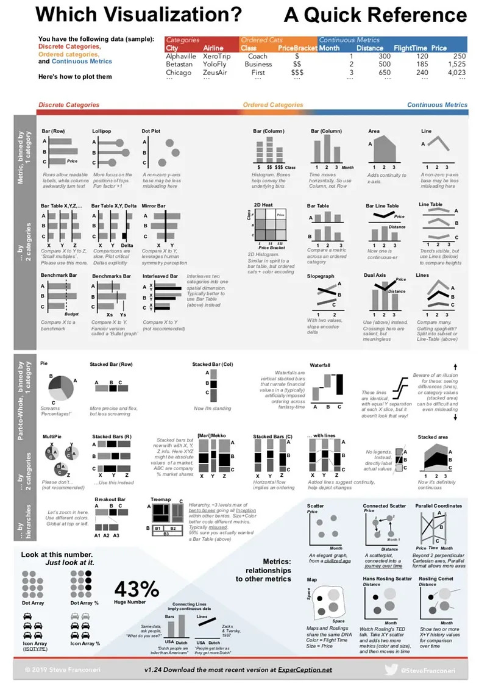

# ビジュアライゼーションの基本 {#rviz}

## Rにおける描画

データを可視化するビジュアリゼーションは、プレゼンテーションだけではなく分析者自身がデータを理解するためにも有効で重要なテクニック。

Rにはデフォルトの描画関数も用意されているが、`tidyverse`シリーズのggplot2というパッケージの関数が強力であり昨今はスタンダードになっていることから、こちらを紹介する。

ggplot2とは、グラフィックの文法 (**g**rammar of **g**raphics)という概念に基づいて作図するパッケージ


## 準備

あらたにRスクリプトを作成し、`data_viz.R`という名前をつけて保存する。

そして、以下のライブラリを読み込んでおく。ライブラリがなくてエラーが出る場合はインストールしてから再度読み込む。

```{r}
library(tidyverse)
```

## 描画をしてみよう

Ch.2の武蔵大学経済学部の学生数のデータを作ってみよう。

```{r label = musashi8_1, echo = FALSE, fig.align = "center", fig.cap = "", fig.width = 10,fig.height = 6}
fig_musashi_students
```


## 復習：データ読み込み

まずデータをダウンロードする。

```{r}
# dataフォルダを作成していない場合はdataフォルダ（ディレクトリ）の作成
fs::dir_create("data")

# データのダウンロードとdataフォルダへの保存
download.file("https://github.com/keita43a/regression_tutorial/blob/main/docs/data/musashi_keizai_students_2025.csv?raw=TRUE",
              destfile="data/musashi_keizai_students_2025.csv")

```

ダウンロードしたデータを読み込む。

```{r}
# エクセルからデータを読み込み
data_634 <- read_csv("data/musashi_keizai_students_2025.csv") 

# long型(tidy data)に変換
data_634_long <- data_634 |> 
  # long型に変換。1年〜４年の列(cols)を学生数という列にvalues_toでまとめる。各行に何年生かnames_toで記録する。
  pivot_longer(cols=c("1年","2年","3年","4年"),names_to ="学年",values_to = "学生数")
```


## 描画の前に

- データに少し工夫を加える
  - データは文字列（カテゴリ）の順番を勝手に決めてしまう。
- 文字列をファクター型に変換する。
  - 描画するときにカテゴリの順番を揃えたいので、順番の情報を与える。

```{r, echo=FALSE, eval=FALSE}
data_634_long = data_634_long %>%%>%
  mutate(学科 = factor(学科, levels=c("経済学科","経営学科","金融学科")),　# 学科の順番
         性別 = factor(性別, levels=c("女","男")),                         # 性別の順番
         学年 = factor(学年, levels=c("1年","2年","3年","4年")))           # 学年の順番
```


## キャンバスを用意する

- まずキャンバスを用意するイメージでggplot()関数を呼び出す

```{r, fig.align='center', fig.height=4, fig.width=7.5}
plot_634 <- ggplot()

print(plot_634)
```


## グラフのレイヤーを追加する

- グラフの種類ごとにデータを表現する幾何学的オブジェクト`geom_`が用意されている
- `geom_bar`は棒グラフで表現する。
- 引数として、用いるデータ`data`, x軸, y軸, 色などにデータを割り当てる`mapping`,そして、変数をどう扱うかという`stat`がある。
  - `mapping`には`aes`という関数を使ってデータを当てはめる。
  - x軸は学年、y軸は学生数とする。
  - `stat`にはデータそのものの数値を使うため、`"identity"`を指定する。


```{r, fig.align='center', fig.height=4, fig.width=7.5}
plot_634 <- ggplot() +
  geom_bar(data=data_634_long, mapping=aes(x=学年, y=学生数),stat="identity")  # <- 追加！

print(plot_634)
```


## 文字化けに対処する

- Macを使っていると、ggplotで日本語を使うと文字化けすることが知られている
  - **豆腐化現象**と呼ばれている
- 文字化けに対処するため、日本語のフォントを指定する。
  - Windowsは多分不要。
- 新しく`theme_grey`というレイヤーを作り、その中の`base_family`という引数でフォント名`"YuGothic"`を指定する。


```{r, fig.align='center', fig.height=4, fig.width=7.5}
plot_634 <- ggplot() +
  geom_bar(data=data_634_long, mapping=aes(x=学年, y=学生数),stat="identity") +
  theme_grey(base_family="YuGothic")  # <- 追加！

print(plot_634)
```


## aesに色を追加する

- 男女別に表示したいので、男女を色で分けたい
- マッピングでaesの中に色の変数として性別を指定する。
- 色のマッピングには二種類あり、点・線・枠の色を指定する`color`と、面の色を指定する`fill`がある。
 - この場合は塗りつぶしたいので、`fill`を指定する。
 - 色は指定しなければ自動的に決められる。


```{r, fig.align='center', fig.height=4, fig.width=7.5}
plot_634 <- ggplot() +
  geom_bar(data=data_634_long, mapping=aes(x=学年, y=学生数, fill=性別),stat="identity")+  # <- 追加！
  theme_grey(base_family="YuGothic")

print(plot_634)
```


## 男女の置き方を変えたい

- 男女を縦に積むのではなく、横に置くことで対比がしやすくなりそう。
- geom_bar()の引数の`position`を`dodge`に指定する。
  - デフォルトは`stack`になっている（文字通り「積む」）


```{r, fig.align='center', fig.height=4, fig.width=7.5}
plot_634 <- ggplot() +
  geom_bar(data=data_634_long, mapping=aes(x=学年, y=学生数, fill=性別), # <- 追加！
           stat="identity", position="dodge")+ 
  theme_grey(base_family="YuGothic") 

print(plot_634)
```


## 色を変えたい

- 色は指定しなければ自動的に決まる
- わかりやすい、おしゃれな色を使いたい場合はマニュアルで変えられる
- `scale_fill_manual()`の中で`value`という色で変えることが可能。
  - 複数指定する場合は`c()`の中に並べてベクトルとして扱う
  - 色の順番に注意
  - 簡単な色の名前(例：`"blue"`, `"red"`)でも指定できるし、RGB値でも決められる
    - RGB値はネットで検索してみよう
- ここでは、武蔵大学のロゴの緑と黄色を使う。


```{r, fig.align='center', fig.height=4, fig.width=7.5}
plot_634 <- ggplot() +
  geom_bar(data=data_634_long, mapping=aes(x=学年, y=学生数, fill=性別), stat="identity", position="dodge")+
  scale_fill_manual(values =c("#0A6648","#F6B21B")) + # <- 追加！
  theme_grey(base_family="YuGothic")

print(plot_634)
```


## 学科別に分けたい

- 現状では、学科の人数がすべて積算されてしまっているが、データとしては分かれている
- せっかくなので別で表示したいが、もうx軸もy軸も色も使ってしまっている。
- では、グラフ自体を分けてしまおう
- `facet_wrap()`というレイヤーを使う
  - `~`の後に分割に使うカテゴリを指定することで、分割した図を作ってくれる


```{r, fig.align='center', fig.height=4, fig.width=7.5}
plot_634 <- ggplot() +
  geom_bar(data=data_634_long, mapping=aes(x=学年, y=学生数, fill=性別), stat="identity", position="dodge")+ 
  scale_fill_manual(values =c("#0A6648","#F6B21B")) +
  theme_grey(base_family="YuGothic") +
  facet_wrap(~ 学科) # <- 追加！

print(plot_634)
```


## ラベルを変更する・タイトルを追加する

- 通常はラベルを明示する
- lab()レイヤーの中で、X軸なら`x=`, Y軸なら`y=`で変更する
  - 色の凡例のタイトルも`fill=`
  - 今回は学年は明らか、学生数もタイトルで明示するので空欄とする
  - 空欄としたい場合は`""`
- タイトルを追加する場合は、`title=`
  - サブタイトルも`subtitle=`で追加できる
- 右下のノートも`caption=`で追加できる

```{r, fig.align='center', fig.height=4, fig.width=7.5}
plot_634 <- ggplot() +
  geom_bar(data=data_634_long, mapping=aes(x=学年, y=学生数, fill=性別), stat="identity", position="dodge")+ 
  scale_fill_manual(values =c("#0A6648","#F6B21B")) +
  labs(fill="",x="",y="",                                # <- 追加!
       title="武蔵大学経済学部の学科別・男女別学生数",   # <- 追加!
       subtitle="2023年5月1日時点",                      # <- 追加!
       caption = "データ元：武蔵大学公式ウェブサイト") + # <- 追加!
  theme_grey(base_family="YuGothic") +
  facet_wrap(~ 学科) # <- 追加！

plot_634
```


## テーマを変更する1

- **テーマ** (`theme`)はggplotの細かい見た目を設定する
  - 背景、軸の有無、グリッドの数や濃さ、軸ラベルの字の大きさなどなど
- ggplotは背景がグレーのテーマがデフォルト
- `theme`レイヤーで細かい設定を行う
- `theme_***`でデフォルトテーマを使うこともできる
  - <a href ="https://ggplot2.tidyverse.org/reference/ggtheme.html" target = "_blank">ここ</a>でどんなテーマがあるか見られる

### デフォルトテーマを使った変更

- ここでは見た目をスッキリさせるデフォルトテーマ`theme_minimal`を使ってみる


```{r, fig.align='center', fig.height=4, fig.width=7.5}
plot_634 <- ggplot() +
  geom_bar(data=data_634_long, mapping=aes(x=学年, y=学生数, fill=性別), stat="identity", position="dodge")+ 
  scale_fill_manual(values =c("#0A6648","#F6B21B")) +
  labs(fill="",x="",y="",                                
       title="武蔵大学経済学部の学科別・男女別学生数",   
       subtitle="2023年5月1日時点",                      
       caption = "データ元：武蔵大学公式ウェブサイト") + 
  theme_minimal(base_family="YuGothic") +     # <- 変更!
  facet_wrap(~ 学科) ## <- 追加！
```


```{r, echo=FALSE,fig.height=6, fig.width=10,fig.align='center'}
print(plot_634)
```


### 細かいテーマ設定

- 細かいテーマ設定を`theme`レイヤーの中で行う
  - `panel.grid.major.x`はメインのグリッドの設定
    - element_blank()は、「空」にするという設定
  - `legend.position`で、凡例を右ではなく下`"bottom"`に
  - `text`で図の中の文字を設定
    - `element_text()`で設定する
    - `size=15`としてフォントサイズを15にする。

```{r, fig.align='center', fig.height=4, fig.width=7.5}
plot_634 <- ggplot() +
  geom_bar(data=data_634_long, mapping=aes(x=学年, y=学生数, fill=性別), stat="identity", position="dodge")+ 
  scale_fill_manual(values =c("#0A6648","#F6B21B")) +
  labs(fill="",x="",y="",                                
       title="武蔵大学経済学部の学科別・男女別学生数",   
       subtitle="2023年5月1日時点",                      
       caption = "データ元：武蔵大学公式ウェブサイト") + 
  theme_minimal(base_family="YuGothic") +
  theme(panel.grid.major.x = element_blank(),   # <- 追加!
        legend.position = "bottom",             # <- 追加!
        text = element_text(size=15)) +         # <- 追加!
  facet_wrap(~ 学科) 
```


## 完成形

```{r label = musashi_comp, echo = FALSE, fig.align = "center", fig.cap = "", fig.width = 12,fig.height = 7}
plot_634
```


## ggplot2による図の保存

- ggplotで作図した結果をオブジェクトに保存
  - ここの例では`plot_634`に保存

- `fig`という名前のフォルダを作っておく。
- `ggsave`という関数で、ファイルパスを指定して保存
  - `file`という引数に、`"fig/musashi_students_2023.png"`と指定
    - `fig`ディレクトリの下に`musashi_students_2023`という名前で`png`形式ファイルとして保存するという意味
  - `plot`に保存したいggplotオブジェクト（描画したもの）を指定
  - `device`に保存したい画像形式を指定。ここでは`png`を指定している。他には`tiff`,`pdf`,`jpg`など。
  


```{r, eval=FALSE}
# figフォルダ（ディレクトリ）の作成
fs::dir_create("fig")
```

```{r}
# ggsave()関数を使って、図を保存
# file: 保存する場所, plot: 図のオブジェクト, device: 保存する形式
ggsave(file="fig/musashi_students_2023.png", plot=plot_634, device="png")

```


## 他の描画レイヤー


|     関数       |     描画            |
|----------------|---------------------|
| `geom_point`   |  散布図             |
| `geom_line`    |  折れ線グラフ       |
| `geom_boxplot` |  箱ひげ図           |
| `geom_violin`  |  バイオリンプロット |
| `geom_map`     |  地図を描く         |


- 他にも多くの描画レイヤーが存在する
 - [参考](https://ggplot2.tidyverse.org/reference/)


### **練習問題**：散布図 {#scatterpractice}

ここでは`diamonds`というggplotに付属しているデータセットを使う。

このデータには、ダイヤモンドの一つ一つのクオリティとその価格が記録されている。クオリティはいやゆるダイヤモンドの4Cと言われるカラット(Carat), カット(Cut), 色(Color), 透明性(Clarity)で表されている。

ここでは、大きさであるカラットと価格の関係性、さらに色の影響を見てみる。

```{r}
# diamondsというデータを読みこむ
data(diamonds)

# diamondsの変数を確認する
names(diamonds)

# diamondsのデータの冒頭を確認する
head(diamonds)

```

**課題**：以下の画像を作成してみよう。

```{r, echo=FALSE, fig.align='center', fig.height=4, fig.width=7.5}
plot_scatter <- ggplot(data=diamonds) + 
  geom_point(aes(x=carat,y=price, 
                 color=color))

print(plot_scatter)
```


## **練習問題**: 折れ線グラフ {#lineplotpractice}


ここでは`economics`というggplotに付属しているデータセットを使う。

このデータには、アメリカの主要な経済指標が時系列データとして記録されている。`date`は年月、`pop`は人口(1000人)、`psavert`は個人貯蓄率、`unempmed`は失業期間の中央値（週）、unemployは失業数（1000人）である。


```{r}
# economicsというデータを読みこむ
data(economics)

# diamondsの変数を確認する
names(economics)

# diamondsのデータの冒頭を確認する
head(economics)

```

**課題**：アメリカの失業数の変遷の折れ線グラフを作成しよう。

```{r, echo=FALSE}
plot_line <- ggplot(data=economics) + 
  geom_line(aes(x=date,y=unemploy))
```

```{r, echo=FALSE, fig.align='center', fig.height=5, fig.width=5}
print(plot_line)
```


## 箱ひげ図


- `geom_boxplot`で箱ひげ図を描く
  - 変数の分布を確認するのに有効
- XとYの変数を指定する
- ここでは`mpg`というggplotに付属しているデータセットを使う
- 車の種類をx軸, 各自動車の燃費をy軸


]

```{r}
plot_boxplot <- ggplot(data=mpg) + 
  geom_boxplot(aes(x=class,y=hwy))
```
```{r, echo=FALSE, fig.align='center', fig.height=5, fig.width=5}
print(plot_boxplot)
```


## ヴァイオリンプロット


- `geom_violin`でヴァイオリンプロットを描く
  - 変数の分布を確認するのに有効
- XとYの変数を指定する
- ここでは`mpg`というggplotに付属しているデータセットを使う
- 車の種類をx軸, 各自動車の燃費をy軸


```{r}
plot_violin <- ggplot(data=mpg) + 
  geom_violin(aes(x=class,y=hwy))
```

```{r, echo=FALSE, fig.align='center', fig.height=5, fig.width=5}
print(plot_violin)
```


## 適した描画？

分析の目的やデータのタイプによって、用いたいグラフは異なる。どのような目的でデータ描画を行うのか考えてから描画に取りかかろう。

```{r pressure, echo=FALSE, fig.cap="データタイプ別のグラフ", fig.align='center',out.width = '80%'}

```


- 棒グラフ：データの大きさを比較する
- 折れ線グラフ：時系列での変化をみる
- 円グラフ：全体に占める割合をみる
- 積み上げ棒グラフ：累積データから内訳を比較する
- 散布図：2つのデータの相関関係をみる

例：[グラフの種類と使い分け、間違った使い方](https://www.tableau.com/ja-jp/learn/articles/graph-type)(Tableau)


## **ゼミ課題**：データの描画

データからグラフを描画し、それを英語で説明するプレゼンテーションを行う。

- [教育用標準データセット](https://www.nstac.go.jp/use/literacy/ssdse/)からデータを選ぶ。
- 選んだデータの中で、変数を選択する。
- 選択した変数について適切なグラフを描画する。
  - 必要に応じてデータを加工する。

他人と同じ変数は使えないため、どのデータのどの変数を描画するかは早いもの勝ちである。

1. 自分がどのデータセットのどの変数を描画するかをGoogle Classroomのストリームに投稿する。（締切：6/4 13:20）

2. 描画した画像ファイルとRコードをGoogle Classroomの課題3-2に提出する。(締切：6/11 13:20）
    - Rコードはkadai_presen_XXX.Rという名前をつけて保存する。XXXには自分の名前を英語で入れる。

3. 描画した画像ファイルについて、2~3分のプレゼンテーションを行う（実施日：6/18 ゼミ）
    - 英語で作成したグラフの説明を行う2~3分のプレゼンを準備する。
    - 提出された画像からスライドを作るのでスライドは用意しなくて良い。
    - 画像だけで自分で英語で説明する。どういうデータなのか、何を説明しているのか、グラフから何が言えそうか。
    - 原稿やスマホを使ってはいけない。
    - 順番はランダム。


### 例：SSDSE-B県別推移のデータ

ここでは一例として、県別推移データの合計特殊出生率を示すデータ描画を作成する。
実際のデータ描画では、どのようなグラフ（棒グラフ・折れ線グラフなど）でも構わない。

0. あらたにRスクリプトを作成し、`kadai_presen_XXX.R`という名前をつけて保存する。`XXX`には自分の名前を英語で入れる。

そして、以下のライブラリを読み込んでおく。

```{r}
library(tidyverse)
```

1. データをダウンロードして、dataフォルダに入れる。

2. データを読み込む。日本語のデータでエンコーディングがShift-JISなのでencodingを変更する必要がある（セクション\@ref(datajpn)参照）。
ここではdataフォルダの下にSSDSEというフォルダを作って、そこにデータファイルを保存しているので、`data/SSDSE/SSDSE-B-2024.csv`をパスとして指定しているが、もしdataフォルダに直接保存している場合は`data/SSDSE-B-2024.csv`となる。
また、列名が2行にわたってしまっているので、最初の一行をskipするため、`skip=1`という引数を指定している。

```{r}
data_ssdse <- read_csv("data/SSDSE/SSDSE-B-2024.csv", 
                       locale=locale(encoding="CP932"), 
                       skip=1)

# 変数名を確認
names(data_ssdse)
```

3. **データの加工**: 都道府県別の合計特殊出生率の推移を比較する。しかし、すべての都道府県では多すぎるため、関東の１都６県に限定する。

```{r}

data_kanto <- data_ssdse |> 
  filter(都道府県 %in% c("東京都","神奈川県","千葉県","埼玉県","茨城県","栃木県","群馬県"))

#  %in% は 「都道府県というカテゴリ変数が、c()の中のいずれかに該当すれば真、という命題を表す。

```


4. グラフ描画する

```{r}

plot_f_rate <- ggplot(data=data_kanto,aes(x=年度, y=合計特殊出生率, color=都道府県)) + 
  geom_line() +
  geom_point() +
  theme_bw(base_family = "YuGothic")

plot_f_rate

```

５．英語で発表するため、英語に変換する


```{r}

plot_f_rate <- ggplot(data=data_kanto,aes(x=年度, y=合計特殊出生率, color=都道府県)) + 
  geom_line() +
  geom_point() +
  theme_bw(base_family = "YuGothic") +
  # ラベルを変換
  labs(x="Fiscal Year", y="Total Fertility Rate", color="Pref.") 

plot_f_rate
  
```

6. 保存する。ここではpng形式で保存している。保存するファイルのパスの最後（ファイル名）に.pngを指定し、`device`という引数にpngを指定している。
保存したファイルはパワーポイントなどに貼ることができる。

```{r}
ggsave("fig/fertility_rate_by_pref_2010_2021.png",plot_f_rate,
       device="png")
```


## よくある問題と対策 {#makefigFAQ}

Q1.[軸の数値がおかしい](#axisnum)  
Q2.[字が小さい](#smallletter)  
Q3.[軸の数値がいい感じにならない](#axisnumadjust)  
Q4.[軸の目盛りラベルを調整する](#axislabeladjust)  
Q5.[凡例や目盛りラベルも日本語化したい](#jpntrans)  

### 軸の数値がおかしい {#axisnum}

下の図のY軸ように、やたら数値の表示が多かったり、変な順番になっている場合は、数値として使っている変数が数値型ではなく文字列型になっている可能性が高いです。

```{r, echo =FALSE}
ggplot(data=data_kanto,aes(x=年度, y=as.character(合計特殊出生率), color=都道府県)) + 
  geom_line() +
  geom_point() +
  theme_bw(base_family = "YuGothic") +
  labs(x="Fiscal Year", y="Total Fertility Rate", color="Pref.") +
  theme(text = element_text(size=15)) 
```
その場合は、文字列型のデータを数値型に変換します。
`mutate`を使って、データを編集するのが妥当ですが、アドホックな対応としては、ggplotの中で`as.numeric()`を使ってしまう方法です。以下のコードの`y=`のところに注目してください。

```{r}
# yの変数を指定するときにas.numeric()で囲み、数値型にする
ggplot(data=data_kanto,aes(x=年度, y=as.numeric(合計特殊出生率), color=都道府県)) + 
  geom_line() +
  geom_point() +
  theme_bw(base_family = "YuGothic") +
  labs(x="Fiscal Year", y="Total Fertility Rate", color="Pref.") +
  theme(text = element_text(size=15)) 
```

### 字が小さい {#smallletter}

上のコードでも触れていますが、字が小さい図はプレゼンテーションでは読みにくく効果的ではありません。

```{r, echo=FALSE}
ggplot(data=data_kanto,aes(x=年度, y=as.numeric(合計特殊出生率), color=都道府県)) + 
  geom_line() +
  geom_point() +
  theme_bw(base_family = "YuGothic") +
  labs(x="Fiscal Year", y="Total Fertility Rate", color="Pref.") +
  theme(text = element_text(size=10)) 
```

字を一括で大きくするには、`theme()`関数の中で、`text`という引数で設定します。その際、`element_text()`という関数の中で指定します。

```{r, echo=FALSE}
ggplot(data=data_kanto,aes(x=年度, y=as.numeric(合計特殊出生率), color=都道府県)) + 
  geom_line() +
  geom_point() +
  theme_bw(base_family = "YuGothic") +
  labs(x="Fiscal Year", y="Total Fertility Rate", color="Pref.") +
  # 字を一括で大きくする
  theme(text = element_text(size=18)) 
```

より細かくそれぞれの部分の字のサイズなどを設定したい場合は、以下の表に基づいて、`theme()`関数の中の引数で指定してください。

```{r, echo = FALSE}
theme_elements <- data.frame(
  要素名 = c("axis.title", "axis.title.x", "axis.title.y", 
           "axis.text", "axis.text.x", "axis.text.y",
           "legend.title", "plot.title", "strip.text",
           "strip.text.x", "strip.text.y"),
  説明 = c("両軸ラベルの体裁", "x軸ラベルの体裁", "y軸ラベルの体裁",
         "両軸目盛ラベルの体裁", "x軸目盛ラベルの体裁", "y軸目盛ラベルの体裁",
         "凡例項目の体裁", "タイトルの体裁", "両方向ファセットラベルの体裁",
         "水平方向ファセットラベルの体裁", "垂直方向ファセットラベルの体裁")
)

knitr::kable(theme_elements)
```

### 軸の数値がいい感じにならない{#axisnumadjust}

例えば以下の図では、年度なのに2012.5とか2015.0みたいな小数がついた表記になることもあります。間違ってはいないですが、いい感じではないですね。


```{r, echo=FALSE}
ggplot(data=data_kanto,aes(x=as.numeric(年度), y=as.numeric(合計特殊出生率), color=都道府県)) + 
  geom_line() +
  geom_point() +
  theme_bw(base_family = "YuGothic") +
  labs(x="Fiscal Year", y="Total Fertility Rate", color="Pref.") +
  scale_x_continuous(n.breaks=6) +
  theme(text = element_text(size=15)) 
```


`scale_x_continuous()`というレイヤーを追加して、この中の引数で`n.breaks`を指定すると、目盛りをいくつに設定したいかを変更できます。例えば8にすると以下のように2年ごとに整数で表記ができます。

```{r}
ggplot(data=data_kanto,aes(x=as.numeric(年度), y=as.numeric(合計特殊出生率), color=都道府県)) + 
  geom_line() +
  geom_point() +
  theme_bw(base_family = "YuGothic") +
  labs(x="Fiscal Year", y="Total Fertility Rate", color="Pref.") +
  # 目盛りを８つ表示するようにする。
  scale_x_continuous(n.breaks=8) +
  theme(text = element_text(size=15)) 
```

 目盛りの数はggplotによって調整される場合もあります。
  
もしくは、`breaks`で直接表示したい数値だけ指定することもできます。この場合は2010年から2021年のすべてを表示しています。

```{r}
ggplot(data=data_kanto,aes(x=as.numeric(年度), y=as.numeric(合計特殊出生率), color=都道府県)) + 
  geom_line() +
  geom_point() +
  theme_bw(base_family = "YuGothic") +
  labs(x="Fiscal Year", y="Total Fertility Rate", color="Pref.") +
  # x軸に2010, 2015だけを表示する
  scale_x_continuous(breaks=2010:2021) +
  theme(text = element_text(size=15)) 
```


y軸にも同じようなことができます。その場合は`scale_y_continous`を使ってください。


### 軸の目盛りラベルを調整する {#axislabeladjust}

軸の数字同士が重なったりして読みにくくなっているケースがあります。

```{r, echo=FALSE}
ggplot(data=data_kanto,aes(x=as.numeric(年度), y=as.numeric(合計特殊出生率), color=都道府県)) + 
  geom_line() +
  geom_point() +
  theme_bw(base_family = "YuGothic") +
  labs(x="Fiscal Year", y="Total Fertility Rate", color="Pref.") +
  # x軸の目盛りラベルの字の大きさを変える。
  scale_x_continuous(breaks=2010:2021) +
  theme(axis.text.x = element_text(size=18)) 
```

対策として、たとえば、数字を小さくして重ならないようにできます。
このときも、字の大きさを変えたときと同じように`theme`を使いますが、引数で`axis.text.x`を使います。

```{r}
ggplot(data=data_kanto,aes(x=as.numeric(年度), y=as.numeric(合計特殊出生率), color=都道府県)) + 
  geom_line() +
  geom_point() +
  theme_bw(base_family = "YuGothic") +
  labs(x="Fiscal Year", y="Total Fertility Rate", color="Pref.") +
  # x軸の目盛りラベルの字の大きさを変える。
  scale_x_continuous(breaks=2010:2021) +
  theme(text = element_text(size=15),
        axis.text.x = element_text(size=10)) 
```

もしくは、目盛りラベルを傾けることもできます。

```{r}
ggplot(data=data_kanto,aes(x=as.numeric(年度), y=as.numeric(合計特殊出生率), color=都道府県)) + 
  geom_line() +
  geom_point() +
  theme_bw(base_family = "YuGothic") +
  labs(x="Fiscal Year", y="Total Fertility Rate", color="Pref.") +
  # x軸の目盛りラベルの傾きを変える。
  scale_x_continuous(breaks=2010:2021) +
  theme(text = element_text(size=15),
        axis.text.x = element_text(angle = 45)) 
```

傾きましたが、ちょっと軸にラベルがかかっていて、美しくないですね。

こういうときは、`hjust`という引数を変えて位置を調整しましょう。`hjust`は水平方向の位置を調整する引数で0から1の間の数値を取ります。

```{r}
ggplot(data=data_kanto,aes(x=as.numeric(年度), y=as.numeric(合計特殊出生率), color=都道府県)) + 
  geom_line() +
  geom_point() +
  theme_bw(base_family = "YuGothic") +
  labs(x="Fiscal Year", y="Total Fertility Rate", color="Pref.") +
  # x軸の目盛りラベルの傾きを変える。
  scale_x_continuous(breaks=2010:2021) +
  theme(text = element_text(size=15),
        axis.text.x = element_text(angle = 45, hjust = 1)) 
```


### ラベルだけではなく、凡例や目盛りラベルも日本語化したい {#jpntrans}

もともとのデータが日本語なので、凡例や、棒グラフなどを使っている人は軸の目盛りラベルが日本語になっていると思います。

```{r,echo=FALSE}
ggplot(data=data_kanto,aes(x=as.numeric(年度), y=as.numeric(合計特殊出生率), color=都道府県)) + 
  geom_line() +
  geom_point() +
  theme_bw(base_family = "YuGothic") +
  labs(x="Fiscal Year", y="Total Fertility Rate", color="Pref.") +
  scale_x_continuous(breaks=2010:2021) +
  theme(text = element_text(size=15),
        axis.text.x = element_text(angle = 45, hjust = 1)) 
```

これを英語化するには、少し手間がかかります。

一つは、エクセルなどで手動で対応表を作り、それを読みこんで、`left_join`で結合して新たな英語の列を作成する方法です。

この意味がわからない場合は、ggplotの中で手作業で指定しましょう。

例えば、この図ではcolorで都道府県を指定しています。
ですので、`scale_color_discrete`というレイヤーを追加して指定します。もし棒グラフなどでx軸やy軸の目盛ラベルを日本語化したい場合は、`scale_x_discrete`や`scale_y_discrete`を使ってください。

`scale_color_discrete`の中では、まず`breaks`という引数で、今存在する日本語の項目をすべて列挙します。ここで指定し忘れると、図から消えてしまうので気を付けてください。

次に`labels`という引数で、変更したい形（今回はアルファベット表記）を指定します。このとき、順番を`breaks`で指定した順番と同じにしてください。


```{r}
ggplot(data=data_kanto,aes(x=as.numeric(年度), y=as.numeric(合計特殊出生率), color=都道府県)) + 
  geom_line() +
  geom_point() +
  theme_bw(base_family = "YuGothic") +
  labs(x="Fiscal Year", y="Total Fertility Rate", color="Pref.") +
    # ラベルも英語化する。
  scale_color_discrete(breaks = c("千葉県","埼玉県","東京都","栃木県","神奈川県","群馬県","茨城県"),
                       labels = c("Chiba","Saitama","Tokyo","Tochigi","Kanagawa","Gumma","Ibaragi")) +
  scale_x_continuous(breaks=2010:2021) +
  theme(text = element_text(size=15),
        axis.text.x = element_text(angle = 45, hjust = 1)) 
```