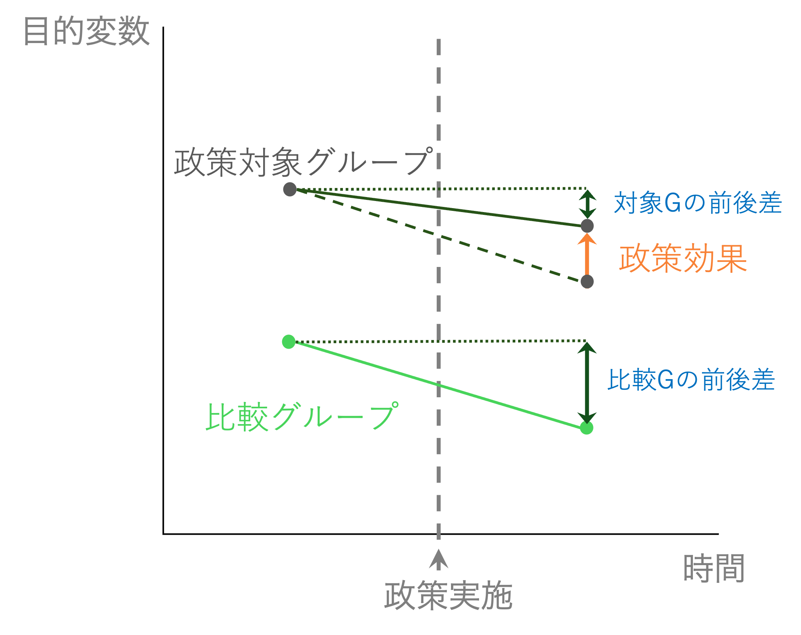

# 差の差法 {#did}


## 差の差法とは

ここからは、より因果関係を推定できる可能性が高い**疑似実験**の手法を学んでいきます。

差の差法（Difference-in-Differences, DiD, 差分の差分法)は、文字通り2つのグループの差に差があるか、をみることであるグループに嗜好された政策や出来事の効果や影響を推定しようとするアプローチである。


### 差の差法のアイデア

パネルデータで説明したような状況でもあっても、目的変数と説明変数の両方に影響を与える変数の存在を完全に排除しきれるわけではない。
パネルデータで紹介した固定効果モデルでも、固定効果を除いた説明変数の効果を推定できているが、固定効果ではない変数が存在している可能性も否定はできない。

より因果関係により迫れる方法として、疑似実験が挙げられる。これはあたかも実験のような状況を見つけ出して、実験でいう処置群（政策などの影響を受けるグループ）と、対照群（効果・影響を受けないグループ）を比較する方法である。

本当の実験であれば、処置を行う前はいずれのグループも全く同じであり、処置を受けた後に2つを比較すれば、その差が処置の効果だと言うことになる。

実際の社会では、政策などが実施される前後で2つのグループが全く同じ、ということはまれであろう。
しかし、2つのグループが異なるけれど、同じような動きをする、と考えればもう少し可能性は広がる。

例えば、埼玉県と東京都の平均所得は当然異なるが、景気などによって東京都の所得が上がっているときは埼玉県の所得も上がっていそうだ。
このように平行に推移する目的変数であるならば、差だけをとっても比較はできないが、差の差、を取ることで比較することが可能になる。

下の図は、差の差法の概念を示した図である。

```{r}

```

処置群は、なんらかの政策を受ける。効果があるならば、政策によって目的変数が変化する。
しかし、前後関係だけで比較することはできない。なぜならば、その前後の変化は政策以外による影響もあるかもしれないからだ。

仮に、東京都の中学校で１クラス40人学級だったものを、30人学級に変更するという政策が行われたとしよう。
担任の教師ひとりが担当する生徒数が減るので、より目が行き届くようになり、生徒にとって良い影響があると期待される。
例えば、平均的な試験のスコアが上がると期待される。
この変更を実際に施行して東京都の中学校の試験の平均スコアを比較してみたとしよう。すると、図のように前回よりも下がっていたとしたらどうだろうか？
クラスの人数を少なくすることはよいことどころかスコアを悪化させる悪い政策だったのだろうか？

となりの埼玉県でも同じテストを実施しているとしよう。しかし、東京都と違って埼玉県ではこの時期にクラス人数の変更やその他テストスコアに影響しそうな施策を変更していないとする。この埼玉県の中学校を比較対象グループとする。
埼玉県のテストスコアを見てみると、大きく減少している。例えば、たまたま学級サイズ変更後のテストが前年のテストより難しかった可能性がある。

埼玉県と東京都は東京都のほうが上だが、普段は同じような動きをするとする（平行トレンドの家庭）。
そこで、埼玉県の「前後の差」を東京都の「もし学級サイズの変更がなかった場合の差」として考えてみる。
すると、東京都はもし学級サイズの変更がなければ図の点線のような動きになっていたことになる。すなわち、もっとテストスコアが悪かっただろう、ということだ。

そこで、「実際に観察された東京都の前後差」を埼玉県の前後差から引くと、「東京都がもし学級サイズを変更していなかった場合のテストスコアの差」から「東京都が学級サイズを変更した場合（つまり現実）のテストスコアの差」を引くことと同義になり、東京都で学級サイズを変更したことによるテストスコアへの影響を推定できることになる。

これが差分の差分法のアイデアである。


### 差分の差分法の仮定

因果推定としての差分の差分法による推定では、以下のような仮定を置いて推定する。以下の仮定が明らかに成り立たない場合は、この方法は使えないことに留意が必要だ。

- 平行トレンドの仮定：処置グループと対照グループはもし政策の施行がなければ平行に推移する。
- スピルオーバーがない：処置グループの効果や影響が対照グループに影響しない。


### 回帰分析を使って行う方法

比較するというアイデアは上の通りだが、それを実際にどうやって推定するのだろうか？

ここでは、回帰分析を使って差分の差分法を推定する方法を説明する。

差分の差分法が適用できるようなデータは、少なくとも2つの期間（政策施行前と後）があり、2つのグループ（政策が施行されたグループと対照グループ）がある。
データでは、それぞれ個々人や自治体などのユニットで値は異なるが、簡単に説明するためにそれぞれのグループの平均だけで話をすると、以下のように整理できる。

|          | 対照群 (A) | 処置群 (B) |
| -------- | :--------: | ---------- |
| 時点 t=1 | $Y_{1A}$   | $Y_{1B}$    |
| 時点 t=2 | $Y_{2A}$   | $Y_{2B}$    |


ここで、処置群の差は$Y_{2B} - Y_{1B}$で表され、対照群の差は$Y_{2A} - Y_{1A}$となる。
差の差で推定される効果は

$$
 (Y_{2B} - Y_{1B}) - (Y_{2A} - Y_{1A})
$$

として表現することができる。平均値だけで言えば、これで推定された値が差の差法で推定された政策の効果である。


これを回帰分析で表現するとどうなるだろうか。
政策前後と対照・処置群両方が含まれたデータを使って、以下のような式を推定するとする。

$$
 Y_{it} = \alpha + \beta_{1} Policy_{i} + \beta_{2} Time_{t} + \beta_{3} Policy_{i} \times Time_{t} + \varepsilon_{it}
$$
ここで、$Policy_{i}$と$Time_{t}$はダミー変数である。$Policy_{i}$はもし、該当データ（個人$i$）が、処置群に入るならば１、対照群ならば０を取る。
$Time_{t}$は該当データ(時点$t$)のタイミングが政策実施後ならば１，政策実施前ならば0を取る。

それぞれのケースを見てみよう。

**ケース１：政策実施前＋対照群**

もし政策実施前で、対照群に入っているデータならば
$$
 Y_{it} = \alpha + \beta_{1} 0 + \beta_{2} 0 + \beta_{3} 0 \times 0 + \varepsilon_{it} = \alpha + \varepsilon_{it}
$$

このケースは、上の表でいうと$Y_{1A}$に当たる。このグループの平均を取ると、誤差項はゼロになるので、$Y_{1A} = \alpha$となる。

**ケース２：政策実施前＋処置群**

もし政策実施前($Time_{t} = 0$)で、処置群($Policy_{i}=1$)に入っているデータならば
$$
 Y_{it} = \alpha + \beta_{1} 1 + \beta_{2} 0 + \beta_{3} 1 \times 0 + \varepsilon_{it} = \alpha + \beta_{1} + \varepsilon_{it}
$$
同様に$Y_1B=\alpha + \beta_1$となる。

**ケース３：政策実施後＋対照群**

もし政策実施後($Time_{t} = 1$)で、対照群($Policy_{i}=0$)に入っているデータならば
$$
 Y_{it} = \alpha + \beta_{1} \cdot0 + \beta_{2} \cdot 1 + \beta_{3} \cdot 0 \times 1 + \varepsilon_{it} = \alpha + \beta_{2} + \varepsilon_{it}
$$

同様に$Y_1B=\alpha + \beta_2$となる。

**ケース４：政策実施後＋処置群**

もし政策実施後($Time_{t} = 1$)で、対照群($Policy_{i}=0$)に入っているデータならば

$$
 Y_{it} = \alpha + \beta_{1} \cdot 1 + \beta_{2} \cdot 1 + \beta_{3} \cdot 1 \times 1 + \varepsilon_{it} = \alpha + \beta_{1} + \beta_{2} + \beta_{3} + \varepsilon_{it}
$$

同様に$Y_2B=\alpha + \beta_1 + \beta_2 \beta_3$となる。


### 演習問題

差の差法による推定効果が、回帰式の$\beta_{3}$と一致することを証明してみよう。


## Rでの演習

### スクリプトの準備

新しいスクリプトにコードを書いていく。
新しくスクリプトを作成し、`did.R`という名前をつけて保存する。

### パッケージの準備

以下のパッケージを使うので読み込んでおく。
インストールしてない場合は、インストールする。

```{r}
# ライブラリ
library(tidyverse)
library(psych)
library(skimr)
library(AER)
library(fixest)
# https://rpubs.com/phle/r_tutorial_difference_in_differences
# https://yukiyanai.github.io/econometrics2/difference-in-differences.html
```


### データの準備

データをダウンロードする。

```{r, eval=FALSE, echo=FALSE}

# このコードはデータをダウンロードして変数名をつけるのに使用。
# 学生がやると混乱するのでこちらですでにできたデータを用意する。

# ファイルのパスを指定する
file_path = "./data/njmin.zip"
dir_path = "./data/njmin"

# Download zip file
download.file("http://davidcard.berkeley.edu/data_sets/njmin.zip", 
              destfile = file_path)

# zipファイルを解凍する
unzip(file_path, exdir = dir_path)

# Codebookから変数名を取得する
codebook <- read_lines(file = paste0(dir_path, "/codebook"))

# 変数名を抜き出す
variable_names <- codebook %>%
  `[`(8:59) %>% # 変数名は８行目から
  `[`(-c(5, 6, 13, 14, 32, 33)) %>% # 変数名の中で余分な行を除く
  str_sub(1, 8) %>% # #1文字目から８文字目だけを各行から抜き出す
  str_squish() %>% # 空白を削除する
  str_to_lower() # すべて小文字にする

 
data_njmin <- read_table(paste0(dir_path, "/public.dat"),
                        col_names = FALSE, na=".") %>%
  select(where(~ !all(is.na(.))))

names(data_njmin) <- variable_names


# 必要な変数だけの取り出し＋変数名の変更＋新しい変数の作成（フルタイムワーカーの割合）
data_njmin <- data_njmin |>
  transmute(
    state = ifelse(state == 1, "NJ", "PA"),  # 州
    fulltime_before = empft,    # 最低時給上昇前のフルタイム労働者の数
    parttime_before = emppt,    # 最低時給上昇前のパートタイム労働者の数
    wage_before     = wage_st,  # 最低時給上昇前の賃金
    fulltime_after  = empft2,   # 最低時給上昇後のフルタイム労働者の数
    parttime_after  = emppt2,   # 最低時給上昇後のパートタイム労働者の数
    wage_after      = wage_st2, # 最低時給上昇後の賃金
    full_prop_before = fulltime_before / (fulltime_before + parttime_before),
    full_prop_after  = fulltime_after  / (fulltime_after + parttime_after)
  ) |>
  na.omit()   # NAが含まれているデータを除外する

# データの保存
write_csv(data_njmin, "data/data_njmin.csv")

```

```{r, echo=FALSE}

# データを読み込む
data_njmin = read_csv("data/data_njmin.csv")

```


```{r, eval=FALSE}

# データのダウンロードとdataフォルダへの格納を自動的に行う
download.file("", 
              destfile = "data/data_njmin.csv")

# データを読み込む
data_njmin = read_csv("data/data_njmin.csv")

```


### データの確認

このデータはアメリカの２つの州におけるファーストフード店の雇用者数や賃金が記録されている。
州のPAはペンシルベニア州、NJはニュージャージー州である。
このデータは差の差分析でもっとも有名な論文であるCard and Krueger (1994)で実際に用いられたデータである。
1992年にニュージャージ州では最低賃金が引き上げられた（\$4.25 ->\$5.05)が、隣のペンシルベニア州ではそのような政策の変更がなかった。
この現象を利用して、差の差分析を用いて最低賃金が雇用に影響をもたらすかどうかを分析した研究である。

データの中身を見てみる。
まずは、どんなデータなのか`head()`で確認する。

```{r}
head(data_njmin)
```


### データの記述統計

データの記述統計を確認しよう。
Chapter \@ref(#rstats)　で説明したように、ここでは`skimr`パッケージの`skim()`関数を使った。

```{r}
library(skimr)

skim(data_njmin)
```


### 政策変更の確認

ここでは、実際に政策変更が行われたかを2 x 2 の表を作成することで確認しよう。

上の表のように、２ｘ２の表では以下のような形となることを理解しよう。
ここでは目的変数（雇用）ではなく、処置を受けた場合に変化する変数（最低賃金）であることに注意しよう。
賃金(wage)なので$w$で表記する。

|          | 対照群 (PA)   | 処置群 (NJ)   |
| -------- | :-----------: | :-----------: |
| 時点 t=1 | $w_{1,PA}$    | $w_{1,NJ}$    |
| 時点 t=2 | $w_{2,PA}$    | $w_{2,NJ}$    |

グループごとの記述統計（セクション\@ref(groupagg)参照）を用いて、上のような表を作ってみよう。

```{r}

njmin_table <- data_njmin |>
  group_by(state) |> # 州ごとにグループ分けを行う
  summarise(before = mean(wage_before), 
            after = mean(wage_after),  
            .groups = "drop") # 混乱を避けるためgroup_byで指定したグループ化を解除

njmin_table

```

上の表と違って、行に州が、列に時期が入ってしまっているが、計算したいことはできている。

予想通り、ペンシルベニア州（PA）では、政策変更の前後ともにあまり平均賃金は変わっていないが、ニュージャージ州（NJ）では変更後に平均賃金が上がっている。
当然ながら、平均賃金は新しい最低賃金（\$5.05)よりも高い。

#### **演習問題**：処置に反応しているかの確認

本当にペンシルベニア州のファーストフード店が最低賃金の引き上げに従っているのだろうか？
政策施行の前後と州ごとに、賃金が5.05 (PAの政策施行後の最低賃金)より低い店の割合を計算し、`njmin_table2`というオブジェクトに格納してから表示しなさい。

ヒント：もし`wage_before < 5.05`という命題が論理値によって評価される場合はTRUEかFALSEが返されるが、TRUEは1, FALSEは0として評価される。
そのため`mean(wage_before < 5.05)`という計算によって、1と0の平均が計算されるということは、`wage_before < 5.05`である割合を計算することと同義である。

```{r, echo=FALSE}
njmin_table2 = data_njmin |>
  group_by(state) |>
  summarize(before = mean(wage_before < 5.05),
            after = mean(wage_after < 5.05),
            .groups = "drop")

njmin_table2
```

結果は上のような表が出力される。
ニュージャージ州の政策施行後だけ、著しく低い割合になっている。すべての店ではないが、多くの店は最低賃金のルールに従って賃金を設定しているようだ。

#### **演習問題**：前後での比較

よく行われる比較は、実際に政策を実行してみた後とその前を比較して「上がったか？下がったか？」を議論するやり方だ。
ニュースなどでも「〇〇を実施した後、△△がX%上昇」などという文言を聞くことがあるだろう。
ここでは、前後比較を計算してみよう。

- ニュージャージー州のみのデータを抽出しなさい
- フルタイム労働者の割合(`full_prop_**`)の平均をそれぞれ政策施行前、後でとりなさい。
- `full_prop_diff`という列を作成し、計算した前後の平均の差を計算しなさい。
- `njmin_table3`というオブジェクトに格納して、コンソールに表示しなさい

```{r, echo=FALSE}
njmin_table3 = data_njmin |> 
  filter(state == "NJ") |>
  summarize(full_prop_before = mean(full_prop_before),
            full_prop_after = mean(full_prop_after),
            .groups = "drop") |>
  mutate(full_prop_diff = full_prop_after - full_prop_before)

njmin_table3
```

上のような表が表示される。
前後の差は0.0238...なので2.4%ポイント上昇したことになる。これは正しい推定だろうか？

当然前後の比較なので、この比較は「もし政策が変わらなければ、NJ州のフルタイム雇用率は政策実施前から変わらない」ことが仮定として暗に置かれている。
しかし、経済状況など様々な他の要因は変わりうる。この前後比較というのは、実はかなり強い仮定（=あまり現実的ではない仮定）のもとで推定されているに過ぎないのである。

### 差の差法

各グループと前後の平均だけで推定する方法で差の差法を推定してみよう。

まず2x2の目的変数の2x2の表を作成する。

|          | 対照群 (PA)   | 処置群 (NJ)   |
| -------- | :-----------: | :-----------: |
| 時点 t=1 | $Y_{1,PA}$    | $Y_{1,NJ}$    |
| 時点 t=2 | $Y_{2,PA}$    | $Y_{2,NJ}$    |

```{r}
njmin_table_did <- data_njmin |>
  group_by(state) |>
  summarize(full_prop_before = mean(full_prop_before),
            full_prop_after = mean(full_prop_after),
            .groups = "drop") 

njmin_table_did
```

さらに上のコードに付け足して、差の差を計算する。

```{r}
njmin_table_did2 <- data_njmin |>
  group_by(state) |>
  summarize(full_prop_before = mean(full_prop_before),
            full_prop_after = mean(full_prop_after),
            .groups = "drop") |>
  mutate(full_prop_diff = full_prop_after - full_prop_before) |>
  with(full_prop_diff[state=="NJ"] - full_prop_diff[state=="PA"])

njmin_table_did2
```

つまり、6.15%ポイント雇用が増加したという推定になる。


