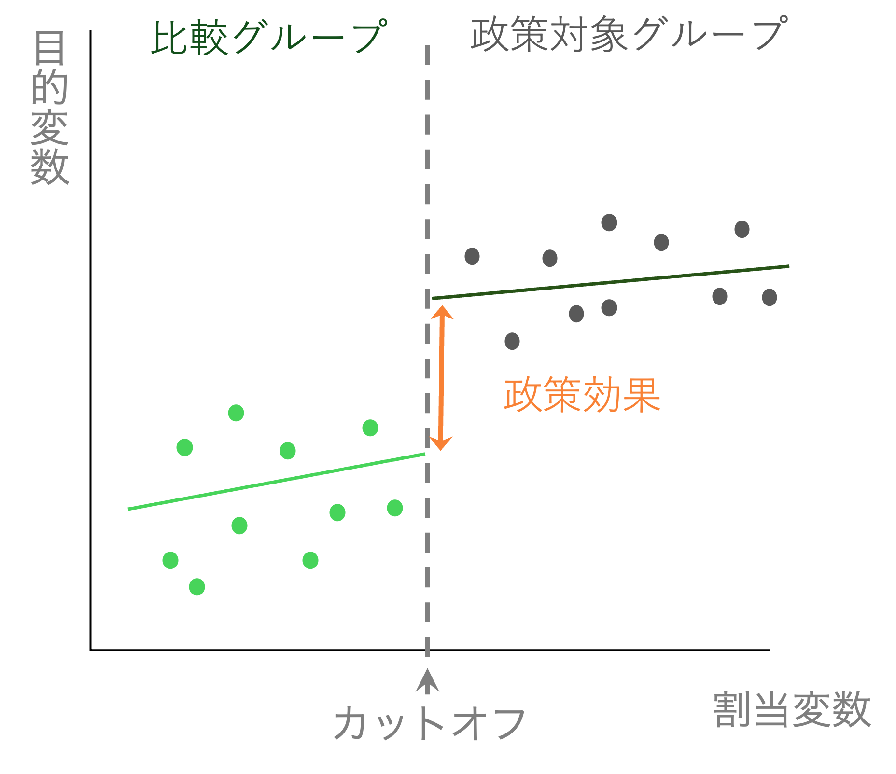
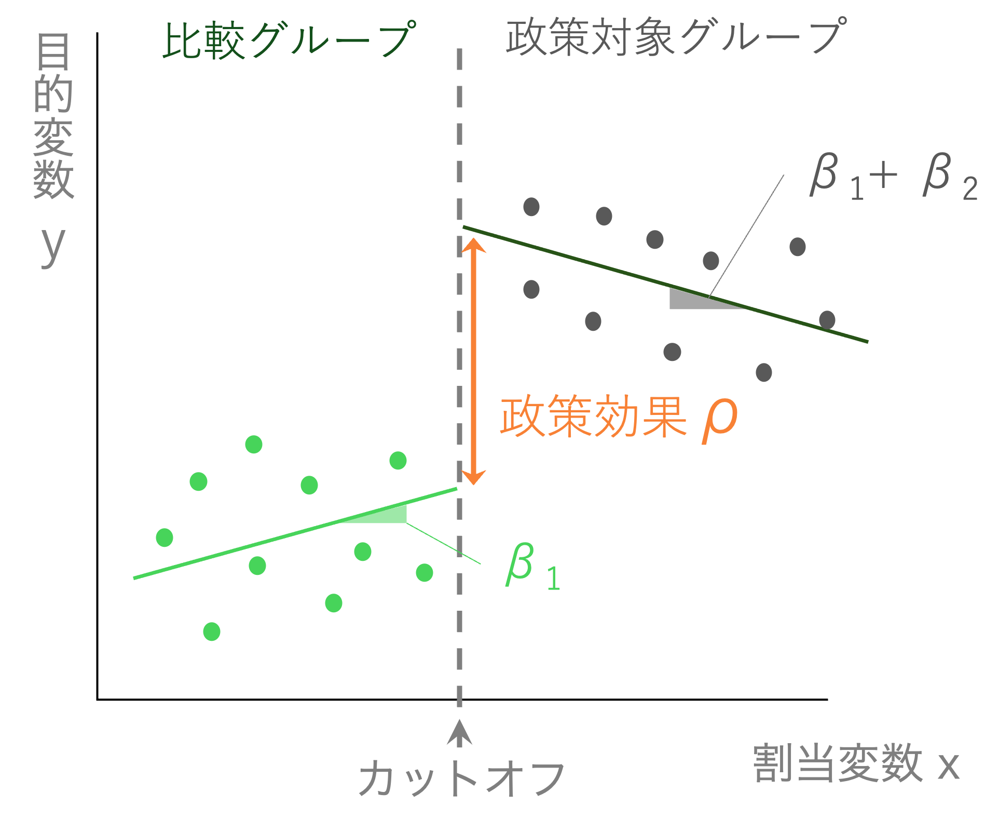
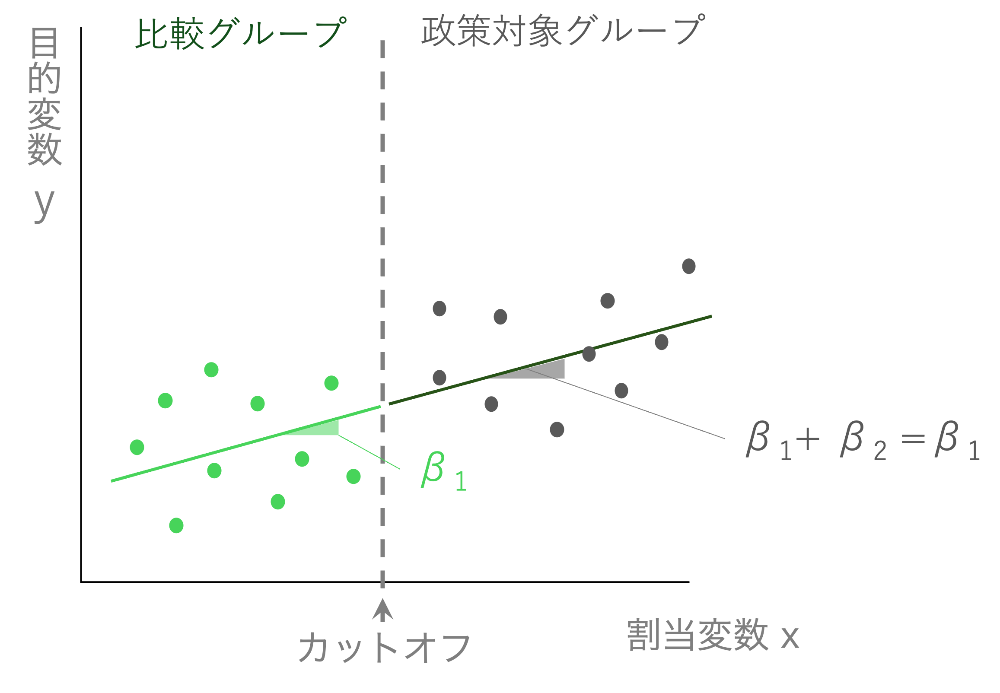
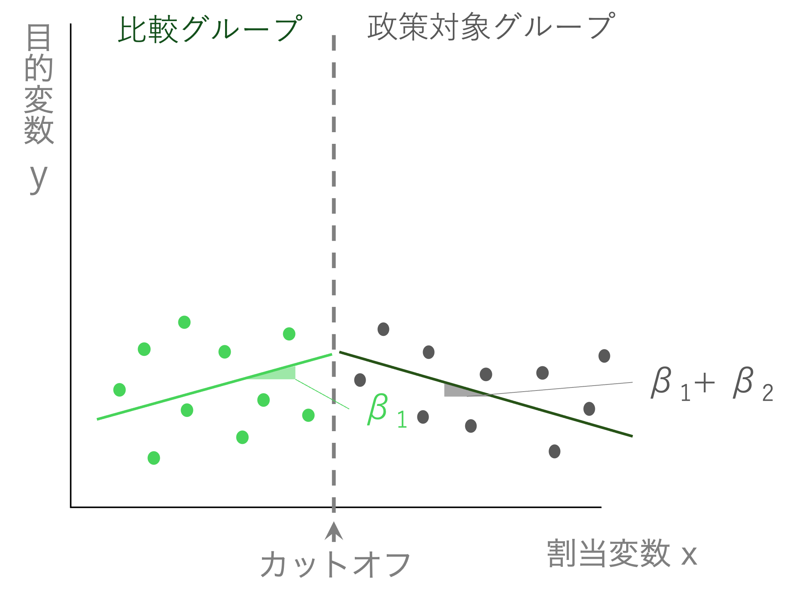

# 回帰不連続デザイン {#rdd}


## 回帰不連続デザインとは

回帰不連続デザイン(Regression Discontinuity Design, RDD)も、回帰不連続デザインと同様疑似実験を用いた手法の一つである。
連続的に変化すると考えられるある変数が、政策介入や処置によって急激な変化（ジャンプ）する場合に、その急激な変化を介入や処置による効果として推定する手法である。

### 回帰不連続デザインのアイデア

お酒・アルコールを飲むのは（好きな人には）楽しいですが、当然負の側面もある。健康被害を起こしたり、また事故なども起こる可能性がある。

アルコールを接種することで、死亡率は上がるのだろうか。

アルコールを接種するかどうかは、法律によって年齢が決まっている。「お酒は二十歳になってから」と言われるように、日本では飲酒の年齢は20歳からである。

つまり、18歳や19歳ならばお酒は飲まないが、20歳以上ならば飲酒するという傾向があるのである。（当然ならば法律を守っているかどうか、という議論はあるが、すくなくても法律を守っていないのは一部で多くは20歳から飲酒するだろう）

しかし、18〜22歳ぐらいまでの若者は基本的には似た性質を持っていると考えられる。20歳になって、いきなり死亡率が増えるとは考えにくい。そのため、18歳や19歳に比べて、20歳や21歳で突然死亡率が上がっているならば、それは20歳をカットオフ（閾値）として扱い（処置）が変わる飲酒傾向によるものと考えることができるだろう。

18-19歳の人々は「対照群」、20-22歳の人を「処置群」として考えることができ、比較が可能となる。これが、基本的な回帰不連続デザインのアイデアである。

```{r, echo=FALSE}

```

年齢によって死亡率は異なるが、少なくともその変化は滑らかであると考えられる。そこで、境界線上に大きな変化（ジャンプ）が起こっていれば、それが政策や処置の効果であると考えて推定を行うのである。

ここでは、年齢のような変数を**割当変数**と呼ぶ。


### 回帰不連続デザインの仮定

- 割当変数と目的変数の間には政策がなければ滑らかに変化する関係がある
- カットオフ前後では政策以外に大きな相違がなくほぼ同じである
- カットオフの存在によって、割当変数を操作するようなことがない
  - 例：奨学金がもらえるカットオフが80点だとする。そこがカットオフだと知っていれば、80点にギリギリみたないような人がいつも以上に頑張って80点以上を取ろうとする。これは、政策（奨学金給付）があることで、政策がなければないようなカットオフ間の移動が起こっているため、仮定を満たさない。


### 回帰分析を使って行う方法


回帰不連続デザインを回帰分析で行う場合は、式としていくつかの方法があるが、ここでは比較グループと政策実施グループで異なる傾きを持つ分割線形回帰を紹介する。

まず回帰式は以下のようになる。

$$
 Y_{i} = \alpha + \rho Policy_{i} + \beta_{1} x_{i} + \beta_{2} Policy_{i} \times x_{i} + \varepsilon_{i}
$$
ここで、$Policy_{i}$はダミー変数である。$Policy_{i}$はもし、該当データが、割当変数でカットオフより大きい（政策によっては小さい）個人$i$が、処置群に入るならば１、対照群ならば０を取る。

例えば、飲酒年齢の問題では年齢が割当変数($x_i$)となる。そして、20歳以上ならば、$Policy_{i}$は1となるが、20歳未満は$Policy_{i}$が0となる。

ここでは、因果効果として推定されるパラメータは$\rho$（ローと読む）である。

上の概念図に対応させると、以下のようになる。

```{r, echo=FALSE}

```

左右の直線は、政策が適用される側（処置群）とされない側（対照群）でデータに基づいてそれぞれ推定された回帰直線である。

もし仮に、推定された結果について$\beta_2$と$\rho$がゼロだとする。すると、回帰式は

$$
 Y_{i} = \alpha + \beta_{1} x_{i} + \varepsilon_{i}
$$
となり、単なる単回帰式となる。図で表すと以下のような形だ。

```{r, echo=FALSE}

```

この場合は、当然ながら政策によって割当変数と目的変数のスムーズな関係に変化は起こっていない。

もし$\beta_2$がマイナスの値で、$\rho$がゼロだったらどうなるか。
この場合は以下のような式になる。

$$
 Y_{i} = \alpha + \beta_{1} x_{i} + \beta_{2} Policy_{i}\times x_{i} + \varepsilon_{i}
$$

この場合の$x_i$の係数は、$\beta_{1} x_{i} + \beta_{2} Policy_{i}\times x_{i} = (\beta_{i} + \beta_{2} Policy_{i})x_{i}$と解釈することができる。つまり、カットオフより下ならば$Policy_{i}=0$なので、係数は$\beta_{1}$になるが、カットオフより上ならば$Policy_{i}=1$なので、係数は$\beta_{1} + \beta_{2}$となる。

```{r, echo=FALSE}

```

もし政策効果がないならば、左右の直線はつながった形になる。もし政策がなければ、目的変数は割当変数に従って滑らかに変化する。もしかしたら比例関係ではなく、どこかで傾向が変わる関係かもしれない。そのために$\beta_2$を推定して、傾向が変わることを許すモデルにしているのである。仮にそのような関係があったとしても、「ジャンプ」がない限りは政策効果はないと考えられる。

政策効果$\rho$がゼロでない場合のみ、2つの直線の間に「ジャンプ」が生じる。これが政策が行われたことによる効果であると解釈される。


## Rでの演習

### スクリプトの準備

新しいスクリプトにコードを書いていく。
新しくスクリプトを作成し、`rdd.R`という名前をつけて保存する。

### パッケージの準備

以下のパッケージを使うので読み込んでおく。
インストールしてない場合は、インストールする。

```{r, eval=FALSE}
# ライブラリ
library(tidyverse)
library(skimr)
library(fixest)

```


### データの準備

データをダウンロードする。

```{r, eval=FALSE, echo=FALSE}

# このコードはデータを作成して変数名をつけるのに使用。
# 学生がやると混乱するのでこちらですでにできたデータを用意する。


library(tibble)

# データを作成
age <- c(66.87270059, 69.75357153, 68.65996971, 67.99329242, 65.7800932, 65.7799726, 65.29041806, 69.33088073, 68.00557506, 68.54036289, 65.10292247, 69.84954926, 69.1622132, 66.06169555, 65.90912484, 65.91702255, 66.52121121, 67.62378216, 67.15972509, 66.4561457, 68.05926447, 65.6974693, 66.46072324, 66.83180922, 67.28034992, 68.92587981, 65.99836891, 67.57117219, 67.96207284, 65.23225206, 68.03772426, 65.85262062, 65.32525796, 69.74442769, 69.82816017, 69.04198674, 66.52306885, 65.48836057, 68.42116513, 67.20076247, 65.61019117, 67.47588455, 65.17194261, 69.54660201, 66.29389991, 68.31261142, 66.55855538, 67.60034011, 67.7335514, 65.92427228, 74.84792314, 73.87566412, 74.69749471, 74.47413675, 72.98949989, 74.60937118, 70.44246251, 70.97991431, 70.22613644, 71.62665165, 71.94338645, 71.35674516, 74.14368755, 71.78376663, 71.40467255, 72.71348042, 70.70462112, 74.0109849, 70.37275322, 74.93443468, 73.86122385, 70.99357841, 70.02761059, 74.07730714, 73.53428672, 73.64503584, 73.85635173, 70.37022326, 71.79232864, 70.5793453, 74.31551713, 73.11649063, 71.65449012, 70.31779175, 71.55491161, 71.62591661, 73.64803089, 73.18778736, 74.43606371, 72.36107463, 70.59797123, 73.56622394, 73.80392524, 72.80638599, 73.8548359, 72.46897798, 72.61366415, 72.13770509, 70.12709563, 70.53945713)
effect <- c(-0.09819363, -0.05987894, -0.06221257, -0.1795126, -0.13538173, -0.10654492, -0.06029694, -0.0792959, -0.12031318, -0.09428059, -0.09217144, -0.02657146, -0.08324375, -0.09310272, -0.11696363, -0.0732273, -0.14467843, -0.10390746, -0.11641091, -0.18405283, -0.0640087, -0.11299785, -0.11052986, -0.11509317, -0.16516154, -0.08251467, -0.13716835, -0.12869042, -0.08882283, -0.11515242, 0.01506378, -0.1142187, -0.12061732, -0.04883374, -0.13937536, -0.06048596, -0.10652711, -0.00707068, -0.08119475, -0.08090738, -0.12953176, -0.14891621, -0.07942, -0.01147131, -0.0745704, -0.11921714, -0.03868918, -0.15808575, -0.05598612, -0.01199177, -0.05648528, -0.01582817, 0.00103267, -0.02465652, -0.04732317, 0.00124073, 0.02803556, 0.09408134, 0.03950606, 0.13496369, 0.01196961, 0.04676202, 0.04780211, -0.00721855, 0.07327955, 0.10108753, -0.00446658, 0.01901199, 0.09553908, 0.03040245, -0.04907201, 0.0041056, 0.11554487, 0.02330309, 0.03183891, 0.03442169, -0.02112827, 0.09420822, 0.06880705, 0.04269552, 0.09697838, 0.05136183, -0.00265498, 0.11647185, 0.01016768, 0.0968359, 0.07496916, -0.01478986, 0.04944753, 0.06341755, 0.11914358, 0.11351517, 0.00165209, -0.00381453, -0.03157244, -0.00017007, 0.03387163, 0.0643035, 0.10129263, 0.12057002)

# tibbleを作成
data_rdd <- tibble(age = age |> round(digits=2), visits = effect) |> 
  arrange(age) |>
  mutate(death = -0.3 + 0.06*(age-65) + rnorm(n(),0,sd=0.01))
  


# データの保存
write_csv(data_rdd, "data/data_rdd.csv")

```

```{r, echo=FALSE}

# データを読み込む
data_rdd = read_csv("data/data_rdd.csv")

```


```{r, eval=FALSE}

# データのダウンロードとdataフォルダへの格納を自動的に行う
download.file("https://github.com/keita43a/regression_tutorial/blob/main/data/data_rdd.csv?raw=TRUE", 
              destfile = "data/data_rdd.csv")

# データを読み込む
data_rdd = read_csv("data/data_rdd.csv")

```


### データの確認

このデータは生成されたデータであるが、実際の研究に使われたデータを模倣したものである。
Shigeoka (2014)では、日本の医療費の自己負担割合が70歳を境に3割から1割に下がることに着目し、この自己負担割合の変化が高齢者の死亡率を下げることに貢献しているかどうかを検証した。もし、自己負担割合が下がることで高齢者が病気や怪我のときに病院に行くようになり、それが結果として死亡率の低下に貢献しているのならばこの政策は一定の効果があると言える。

回帰不連続デザインを使う理由は70歳というカットオフが存在するからである。69歳11ヶ月の人は自己負担割合が3割だが、70歳0ヶ月になると突然1割になる。しかし、70歳になったからといって突然不健康になったり死亡率が上がるわけではないため、70歳になって急激に死亡率が下がっているのならば、これは自己負担割合の違いが死亡率の低下に貢献していると言えるというわけだ。


データの中身を見てみる。
まずは、どんなデータなのか`head()`で確認する。

```{r}
head(data_rdd)
```


### データの記述統計

データの記述統計を確認しよう。
Chapter \@ref(#rstats)　で説明したように、ここでは`skimr`パッケージの`skim()`関数を使った。

```{r}
library(skimr)

skim(data_rdd)
```


### データの加工

データには年齢は記録されているが、70歳以上かどうかを示す情報は直接は記録されていない。
年齢から、70歳以上かどうか、というダミー変数を作成しよう。
`ifelse(test,true,false)`という関数は1つ目の引数である`test`に条件式を入れる。その条件式を評価して、真であれば2つ目の引数である`true`に入力された値を返す。偽であれば`false`である3つ目の引数の値を返す。この場合は`age >= 70`が条件式なので、各行において`age`が70以上であれば、`1`を入れ、そうでなければ`0`を入れる。

```{r}
data_rdd <- data_rdd |>
  mutate(dummy70 = ifelse(age >= 70, 1, 0))
```


### 政策による行動への影響

ここでは、政策によって実際に行動が変わっているかをまず確認する。

下のコードでは、`aes()`によるマッピングの中に、`group`という項目が入っている。これは、描画に使うデータを年齢が70歳以上か未満か`dummy70`で分ける機能を持つ。
こうすることで、`geom_smooth`を使うときに、70歳未満と以上で別々の直線を描いてくれる。
`geom_vline`は縦(vertical)の直線を追加するレイヤーである。この場合は、x軸上の70歳(`xintercept = 70`)に縦の直線を、線の種類をダッシュ(`linetype="dashed"`)で、色を赤で(`color="red"`)追加する。

```{r, message=FALSE}
ggplot(data_rdd, aes(x = age, y = visits, group = dummy70)) +
  geom_point(color = 'gray') +
  geom_smooth(method = 'lm', color = 'black', se = FALSE) +
  geom_vline(xintercept = 70, linetype = "dashed", color = "red") +
  labs(x = "年齢", y = "外来患者数(対数)", title = "自己負担割合が減ると外来受診が増える") +
  theme_minimal(base_family="HiraKakuPro-W3")
```

これを見ると、外来患者数には70歳を境に大きなジャンプがある。
つまり、自己負担割合が低くなることで、外来患者の数が急激に増加している。
このことから、自己負担割合の変化は外来診察を受けるインセンティブを高め、高齢患者の行動を変えていると言えそうだ。


#### 回帰分析による推定

回帰分析でこの効果を推定してみよう。

この場合は

$$
 Visits_{i} = \alpha + \rho Dummy70_{i} + \beta_{1}age_{i} + \beta_{2} age_{i}\times Dummy70_{i} + \varepsilon_{i} 
$$
という式を推定することになる。


```{r}

rdd_visit <- feols(visits ~ dummy70 + age + dummy70:age, data=data_rdd)

etable(rdd_visit)

```

結果は$\rho$が1.789と推定された。$Visits$は対数で表示されているため、このジャンプによって訪問患者数が179%増加したという結果になる。

繰り返しになるが、これは元の研究を模倣したデータであり、説明のために大きく省略したアプローチを取っているのでオリジナルの研究とこの数字は一致しない。


### 政策による結果への影響

今度は、政策によって重要な結果、ここでは死亡率に効果があるかを見てみよう。
```{r, message=FALSE}
ggplot(data_rdd, aes(x = age, y = death, group = dummy70)) +
  geom_point(color = 'gray') +
  geom_smooth(method = 'lm', color = 'black', se = FALSE) +
  geom_vline(xintercept = 70, linetype = "dashed", color = "red") +
  labs(x = "年齢", y = "死亡率(対数)", title = "自己負担割合が減っても死亡率は変わらない") +
  theme_minimal(base_family="HiraKakuPro-W3")
```

上と同様に分割して回帰直線を描いているが、あたかもつながっているかのような直線になっている。大きなジャンプは見られず、70歳になって突然死亡率が下がったという傾向はなさそうである。


#### 回帰分析による推定

回帰分析でこの効果を推定してみよう。

この場合は

$$
 Death_{i} = \alpha + \rho Dummy70_{i} + \beta_{1}age_{i} + \beta_{2} age_{i}\times Dummy70_{i} + \varepsilon_{i} 
$$
という式を推定することになる。


```{r}

rdd_death <- feols(death ~ dummy70 + age + dummy70:age, data=data_rdd)

etable(rdd_death)

```

結果は$\rho$が0.1488と推定された。また、統計的に有意ではないため、0であるという仮説を棄却できない。
このことから、死亡率に対する健康保険の自己負担割合の低下は効果を与えていないという結論が導かれる。

## 演習問題：アメリカの飲酒年齢と死亡率

```{r, eval=FALSE, echo=FALSE}
download.file(url = "http://masteringmetrics.com/wp-content/uploads/2015/01/AEJfigs.dta",
              dest = "data/AEJfigs.dta")

data_alcohol <- haven::read_dta("data/AEJfigs.dta")%>% 
  mutate(age = agecell - 21,  # 21歳を中心に年齢を中心化（21歳の誕生日からのズレを測る変数）
         policy = as.integer(agecell > 21))%>% 
  filter(complete.cases(all)) |>
  rename(all_death = all)

write.csv(data_alcohol,"data/data_alcohol.csv")
```

```{r, echo=FALSE}
data_alcohol= read_csv("data/data_alcohol.csv")
```


1. 以下のコードを実行してデータをダウンロードして読み込む。

```{r, eval=FALSE}
# データのダウンロードとdataフォルダへの格納を自動的に行う
download.file("https://github.com/keita43a/regression_tutorial/blob/main/data/data_alcohol.csv?raw=TRUE", 
              destfile = "data/data_alcohol.csv")

# データを読み込む
data_alcohol= read_csv("data/data_alcohol.csv")
```

これはアメリカの誕生日によって区切られた年齢グループ別のデータである。約一ヶ月ごとに誕生日からどれぐらい経っているか（例：20歳の誕生日から1ヶ月以上2ヶ月未満）などのグループ(`agecell`)で区切られている。またそのグループ別に、死因別や合計(`all_death`)の死亡数が記録されている。

2. データの記述統計を確認する。

3. `agecell`を割当変数、`policy`を政策変数、`all_death`を目的変数として回帰不連続デザインの図を描きなさい。アメリカの飲酒年齢は21歳である。

```{r, echo=FALSE, message=FALSE}
ggplot(data_alcohol, aes(x = agecell, y = all_death, group = policy)) +
  geom_point(color = 'gray') +
  geom_smooth(method = 'lm', color = 'black', se = FALSE) +
  geom_vline(xintercept = 21, linetype = "dashed", color = "red") +
  labs(x = "年齢", y = "全死亡者数", title = "") +
  theme_minimal(base_family="HiraKakuPro-W3")
```

4. 以下のモデルを推定して、結果をコンソールに表示する。`age`は`agecell`を21歳を中心として基準化した変数である。（例えば19歳は`age`では`-2`となる。）

$$
 all\_death_{it} = \alpha + \rho Policy_{i} + \beta_{1} age_{t} + \beta_{2} Policy_{i} \times age_{t} + \varepsilon_{it}
$$

5. 結果を解釈する。


