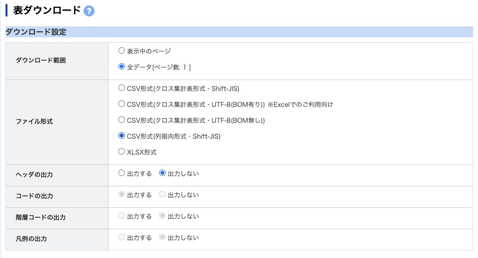
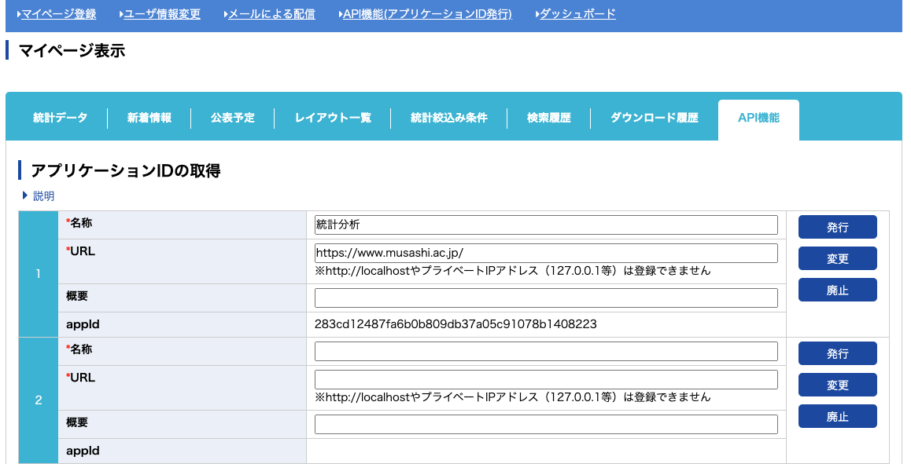
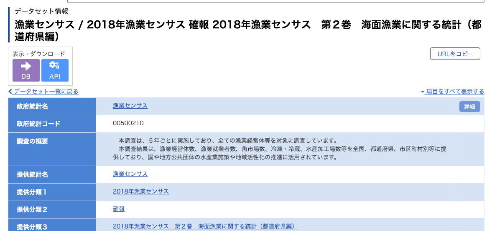
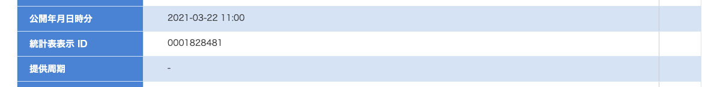

# e-statの利用方法 {#e-stat}


## e-statとは


## e-statの使い方

- e-statの使い方は2種類ある。

1. CSVやエクセルをダウンロードする。
2. e-stat APIからデータを直接Rにダウンロードする(推奨)


1の方法では、ダウンロードしたいページ（例えば[これ](https://www.e-stat.go.jp/dbview?sid=0001828481)）で、右上の「ダウンロード」ボタンを押すと以下のようなページが現れる。データとして分析するためのファイルを読み込む場合は、「CSV形式（列指向形式・Shift-JIS）」を選択し、ヘッダの出力を「出力しない」にしてダウンロードする。

```{r  label = e_stat_DL, echo = FALSE, fig.cap = "", out.width = '70%',fig.align='center'}

```

ダウンロードされたファイルを、自分の作業フォルダなど適切な場所に移して、read_csvなどで読み込ませれば使用することができる。
このファイルはエンコーディングがShift-JISになっているため、そのまま読み込むと文字化けするかエラーが出る。
この問題については、日本語のデータを読み込む際の注意点(#datajpn)を参照してほしい。


## e-stat APIの使い方

一つ一つのファイルをダウンロードするより楽でスムーズな方法がAPIを使う方法だ。

APIとは「アプリケーション・プログラミング・インターフェース（Application Programming Interface）」の略称で、ソフトウェアやプログラム、ウェブサービスの間をつなぐ仕組みのことを指す。

ここでは、e-statという統計情報サービスと、R/R Studioというプログラムの間をつなぐというイメージに当たる。

### APIの準備

まず、e-StatのAPI機能の[ページ](https://www.e-stat.go.jp/api/)に行って、ユーザー登録を行う。
メールアドレスを仮登録したら、メールに来たURLから本登録を行う。

本登録を行う際は、大学のGoogleアカウントを使うと、パスワードの入力などが省略できる。

登録を終えて、ログインしたら、「マイページ」の上部メニューから「API機能（アプリケーションID発行）」を選ぶ。

ここで、名称やURLを求められるが、適当で良い。URLに武蔵大学や阿部ゼミのURLでも入れておけばよい。
必要な情報を入力したら「発行」を押すと、appIdというところにアプリケーションIDが発行される。


```{r  label = appId, echo = FALSE, fig.cap = "", out.width = '70%',fig.align='center'}

```


これでAPIを利用する準備は完了である。


### estatapiパッケージでデータを利用する

まず、新しいスクリプトを用意しよう。

`estatapi`というパッケージをインストールする。

そして、いつも通りtidyverseと`estatapi`パッケージをロードする。

```{r}
library(tidyverse)
library(estatapi)
```

次に、`appID`というオブジェクトを作り、ここに自分のアプリケーションIDを読み込ませる。

```{r}
appID <- "283cd12487fxxxxxxxxxxxxxxxxxxxxxxxxxxx"
```

```{r, echo=FALSE}
appID <- "283cd12487fa6b0b809db37a05c91078b1408223"
```


上のIDは適当なので、自分のIDに置き換えて使う。

例えば、ここでは2018年漁業センサスの第２巻　海面漁業に関する統計（都道府県編）の漁業経営体数・漁船というデータを読み込むとしよう。
e-Statのウェブサイト上で、漁業センサスを検索し、「データベース」を選ぶとこのような[ページ](https://www.e-stat.go.jp/stat-search/database?page=1&toukei=00500210&tstat=000001033844)に飛ぶ。そこから、2018年漁業センサス第2巻を選び、漁業経営体数・漁船を選ぶと、以下のような表が表示される。

```{r  label = e_stat_page1, echo = FALSE, fig.cap = "", out.width = '70%',fig.align='center'}

```

その中で、「統計表表示ID」というものをコピーする。

```{r  label = e_stat_page2, echo = FALSE, fig.cap = "", out.width = '70%',fig.align='center'}

```

Rに戻って、まずは統計のメタデータ（どのような変数が入っているかなど大まかな情報）をダウンロードする。
これには`estat_getMetaInfo`という関数を用いて、`appId`という引数には自分のIDがはいった`appID`オブジェクトを指定し、`statsDataId`には今コピーした統計表表示IDを`""`で囲んで指定する。

```{r}
meta <- estat_getMetaInfo(appId = appID,
                          statsDataId = "0001828481")
```

メタ情報の中身を見てみる。

```{r}
names(meta)
```

cat01やcat02はデータに含まれる属性が示されている。このデータにはないが、timeというメタデータがあれば、それは時間軸が示されている。

```{r}
meta$cat02
```

実際のデータを取得する。
データの取得には`estat_getStatsData`という関数を用いる。
引数は上と同様に、自分のアプリケーションIDと統計表表示IDをそれぞれ指定する。

```{r}
dat <- estat_getStatsData(appId = appID,
                          statsDataId = "0001828481")
```


これで、`dat`オブジェクトに2018年の漁業センサスから、都道府県別の漁業経営体数や漁船数のデータがダウンロードされた。

データを見てみる。

```{r}
head(dat, n=10)
```

`value`という列には異なる変数（経営体数や漁船数）が一気に入ってしまっているので、整然データにはなっていない。


### データ加工の例

ここからはデータのハンドリング（#datahandling）の復習なので、細かい関数の挙動は該当チャプターで復習してほしい。

```{r}
dat2 <- dat |>
  # 列名を簡単なものに変える
  rename("pref" = 2, "item" = 4) |>  # 2列目をprefに、4列目をitemに変更
  # itemに基づいて、複数の列に分ける
  pivot_wider(id_cols = c(cat01_code,pref), # 都道府県（それ以外の項目も含まれているが）ごとに
              names_from = "item",          # 各列にitemという名前をつけて
              values_from = "value") |>       # valueという列に入っている値を振り直す
  # 不要な行を削除（＝必要な行だけ取り出し）
  slice(2:40) |> # 1行目は全国、41行目からは海区別のデータが入ってしまっている。都道府県だけほしいので、そこだけ取り出す。
  mutate(pref = fct_reorder(pref,cat01_code)) # 都道府県のデータをcat01_codeの番号順の要素データとして定義し直す
```

### データ描画の例

詳細については描画についてのチャプター（#rviz）を参照してください。

```{r}
ggplot(data=dat2, aes(x=pref, y=`漁業経営体数`)) + 
  geom_bar(stat="identity") +
  theme_minimal(base_family = "HiraKakuPro-W3") +
  labs(x="都道府県",y="漁業経営体数") + 
  theme(axis.text.x = element_text(angle=40, hjust=1))
```

