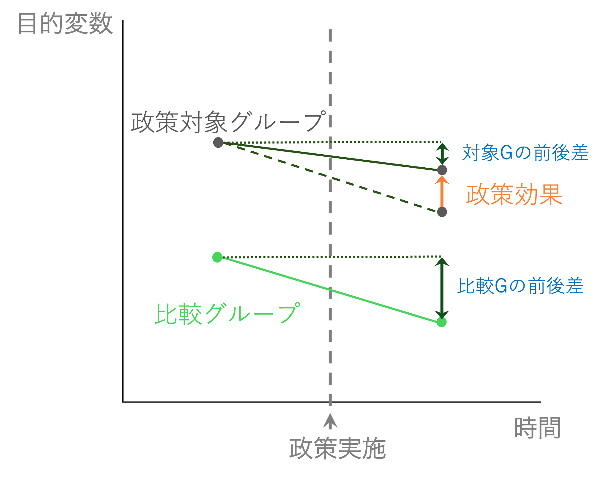

```{r setup, include=FALSE}
knitr::opts_chunk$set(echo = TRUE, warning = FALSE, message = FALSE,
                      fig.height = 3, fig.width = 7)
pacman::p_load(tidyverse, fixest)

data_njmin <- read_csv("data/data_njmin.csv")

data_njmin_long <- data_njmin |>
  dplyr::select(state, starts_with("full_")) |>
  pivot_longer(cols = starts_with("full"),
               names_to = "timing",
               names_prefix = "full_prop_",
               values_to = "prop") |>
  mutate(policy = ifelse(state == "NJ", 1, 0),
         time   = ifelse(timing == "after", 1, 0))

reg_did1 <- feols(prop ~ policy + time + policy:time, data = data_njmin_long)
```

## 今日の内容

1. 固定効果モデルの限界
2. **差の差法（DiD）**のアイデア
3. 平行トレンドの仮定
4. 事例：最低賃金と雇用（Card & Krueger, 1994）
5. 手計算によるDiD推定
6. **回帰分析**によるDiD推定
7. まとめ：DiDの活用

# 差の差法のアイデア

## 固定効果モデルの限界

固定効果（FE）モデルは**時間不変の個体差**を除去できる。

しかし…

**FEでも除去できない交絡因子**

- 処置群と対照群で異なる**時間変動的な要因**
- 処置を決める変数と目的変数が**同時に変動**する場合

より強い因果推論のアプローチ：**疑似実験（quasi-experiment）**

- あたかも実験のような状況を見つける
- 政策などの影響を受ける**処置群**と受けない**対照群**を比較

## DiDのアイデア

前後比較だけでは不十分：

$$\text{政策後} - \text{政策前} = \text{政策効果} + \text{その他の変化}$$

対照群を使って「その他の変化」を取り除く：

$$\underbrace{(Y_{2B} - Y_{1B})}_{\text{処置群の変化}} - \underbrace{(Y_{2A} - Y_{1A})}_{\text{対照群の変化}} = \text{政策効果}$$

2つのグループが**同じように変化する**ならば、対照群の変化を差し引くことで
純粋な政策効果を取り出せる。

## DiDの概念図

```{r did-concept, echo=FALSE, out.width="85%", fig.align="center"}

```

## 平行トレンドの仮定

DiDによる因果推論が成立するための核心的な仮定：

**平行トレンドの仮定（Parallel Trends Assumption）**

> 政策が実施されなかったならば、処置群と対照群の目的変数は
> 同じトレンドで推移していたはずである。

\vspace{0.5em}

**スピルオーバーなしの仮定**

- 処置群への政策効果が対照群に波及しない

\vspace{0.5em}

この仮定が成立しない場合は**DiDは使えない**。

# 事例：最低賃金と雇用

## Card and Krueger (1994)

**研究の問い：最低賃金の引き上げは雇用を減らすか？**

- 従来の理論：最低賃金 $\uparrow$ → 労働コスト $\uparrow$ → 雇用 $\downarrow$

**自然実験の発見**

| | ニュージャージー州（NJ） | ペンシルベニア州（PA） |
|--|:-:|:-:|
| 1992年4月 | 最低賃金：\$4.25 → **\$5.05** | 変更なし |
| 役割 | **処置群** | **対照群** |

- データ：両州のファーストフード店の雇用・賃金（政策前後）
- 目的変数：フルタイム雇用の割合（`full_prop`）

## データの確認

```{r data-head, echo=FALSE}
head(data_njmin, 4)
```

- `state`：州（NJ / PA）
- `fulltime_before/after`：フルタイム労働者数（政策前後）
- `wage_before/after`：賃金（政策前後）
- `full_prop_before/after`：フルタイム雇用比率（政策前後）

# DiDの計算

## 政策変更の確認：2×2表（賃金）

```{r wage-table, echo=FALSE}
data_njmin |>
  group_by(state) |>
  summarise(before = mean(wage_before),
            after  = mean(wage_after),
            .groups = "drop")
```

NJでは政策後に平均賃金が上昇 → **処置を受けている**ことを確認。

PAではほぼ変化なし → 対照群として適切。

## 目的変数の2×2表（フルタイム雇用比率）

```{r emp-table, echo=FALSE}
data_njmin |>
  group_by(state) |>
  summarise(before = mean(full_prop_before),
            after  = mean(full_prop_after),
            .groups = "drop")
```

NJの雇用比率：政策後も大きく下がっていない。

→ 最低賃金引き上げで雇用が**減った**とは言えない？

## 差の差を手計算する

```{r did-calc}
njmin_did <- data_njmin |>
  group_by(state) |>
  summarise(full_prop_before = mean(full_prop_before),
            full_prop_after  = mean(full_prop_after),
            .groups = "drop") |>
  mutate(diff = full_prop_after - full_prop_before)

njmin_did
```

```{r did-value}
# DiD = NJの差 - PAの差
with(njmin_did, diff[state == "NJ"] - diff[state == "PA"])
```

フルタイム雇用比率が約**6.2%ポイント増加**と推定された。

## 平行トレンドの可視化

```{r parallel-trend, echo=FALSE, fig.height=3.5}
data_njmin_long |>
  group_by(state, timing) |>
  summarise(mean_prop = mean(prop), .groups = "drop") |>
  mutate(time_num = ifelse(timing == "before", 0, 1),
         state_label = ifelse(state == "NJ", "NJ（処置群）", "PA（対照群）")) |>
  ggplot(aes(x = time_num, y = mean_prop,
             color = state_label, group = state_label)) +
  geom_line(size = 1.2) +
  geom_point(size = 3) +
  scale_x_continuous(breaks = c(0, 1),
                     labels = c("Before", "After")) +
  labs(x = NULL, y = "Full-time employment ratio", color = NULL) +
  theme_bw() +
  theme(legend.position = "top")
```

# 回帰分析によるDiD

## 回帰式の定式化

$$Y_{it} = \alpha + \beta_1 Policy_i + \beta_2 Time_t + \beta_3 Policy_i \times Time_t + \varepsilon_{it}$$

- $Policy_i$：処置群（NJ）ならば 1、対照群（PA）ならば 0
- $Time_t$：政策後ならば 1、政策前ならば 0
- $\beta_3$：**差の差の推定量**（交差項の係数）

## 4ケースの整理

|  | 対照群（PA）$Policy=0$ | 処置群（NJ）$Policy=1$ |
|--|:-:|:-:|
| 政策前 $Time=0$ | $\alpha$ | $\alpha + \beta_1$ |
| 政策後 $Time=1$ | $\alpha + \beta_2$ | $\alpha + \beta_1 + \beta_2 + \beta_3$ |

\vspace{0.5em}

差の差の計算：

$$\underbrace{(\alpha+\beta_1+\beta_2+\beta_3) - (\alpha+\beta_1)}_{\text{NJの前後差}} - \underbrace{(\alpha+\beta_2) - \alpha}_{\text{PAの前後差}} = \beta_3$$

**$\beta_3$ がDiD推定量** と一致する。

## Long形式データへの変換

```{r long-data, eval=FALSE}
data_njmin_long <- data_njmin |>
  dplyr::select(state, starts_with("full_")) |>
  pivot_longer(cols = starts_with("full"),
               names_to = "timing",
               names_prefix = "full_prop_",
               values_to = "prop") |>
  mutate(policy = ifelse(state == "NJ", 1, 0),
         time   = ifelse(timing == "after", 1, 0))
```

## 回帰分析の実行 {shrink=10}

```{r reg-did}
reg_did1 <- feols(prop ~ policy + time + policy:time,
                  data = data_njmin_long)

etable(reg_did1)
```

## 結果の解釈

| 係数 | 推定値 | 解釈 |
|------|--------|------|
| $\alpha$（切片） | $0.602^{***}$ | PAの政策前フルタイム比率 |
| $\beta_1$（policy） | $0.019$ | NJ-PAの政策前の差 |
| $\beta_2$（time） | $0.052^{***}$ | PA単独の時間変化（共通トレンド） |
| **$\beta_3$（交差項）** | $\mathbf{0.062^{*}}$ | **DiD推定量：政策効果** |

\vspace{0.5em}

- 手計算のDiD（$\approx 0.062$）と一致
- 最低賃金引き上げによってフルタイム雇用比率が約**6.2%ポイント増加**
- 従来の理論（雇用減）とは逆 → **雇用は減っていない**

# まとめ

## DiDの活用と限界

**DiDの強み**

- 観察できない個体差・共通トレンドを同時に除去できる
- 回帰分析の枠組みで実装できる

**前提条件（仮定）**

- 平行トレンドが成立するか → 事前トレンドで確認
- スピルオーバーがないか → 対照群の選択が重要

**DiDが使えない場面**

- 政策が同時に全員に施行される（対照群がない）
- 処置群・対照群で政策前から異なるトレンドがある

次章：**回帰不連続デザイン（RDD）**でさらに鋭い因果推論へ

## 本章のRコード：まとめ

```r
pacman::p_load(tidyverse, fixest)

# Long形式に変換
data_njmin_long <- data_njmin |>
  dplyr::select(state, starts_with("full_")) |>
  pivot_longer(cols = starts_with("full"),
               names_to = "timing",
               names_prefix = "full_prop_",
               values_to = "prop") |>
  mutate(policy = ifelse(state == "NJ", 1, 0),
         time   = ifelse(timing == "after", 1, 0))

# 回帰分析によるDiD（交差項 = DiD推定量）
feols(prop ~ policy + time + policy:time,
      data = data_njmin_long)
```
