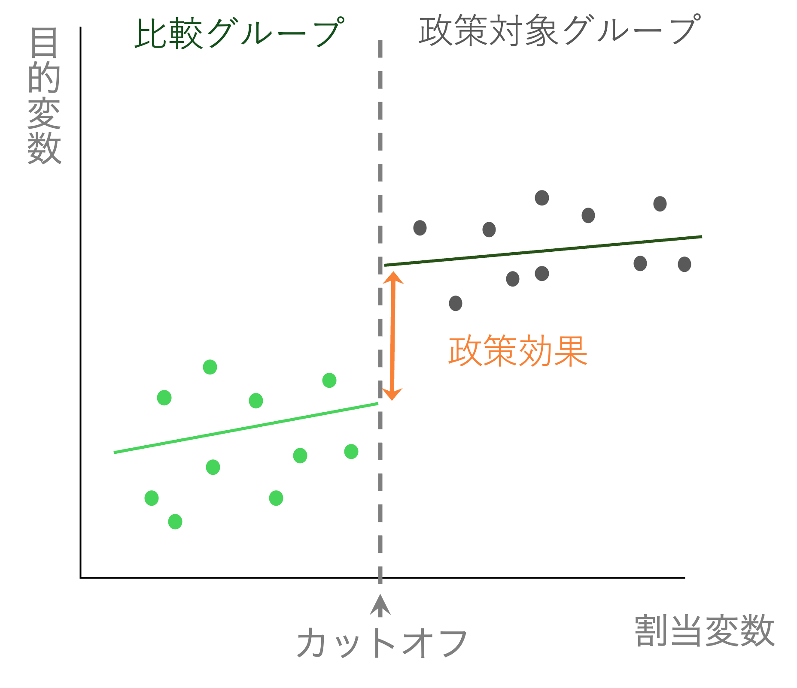
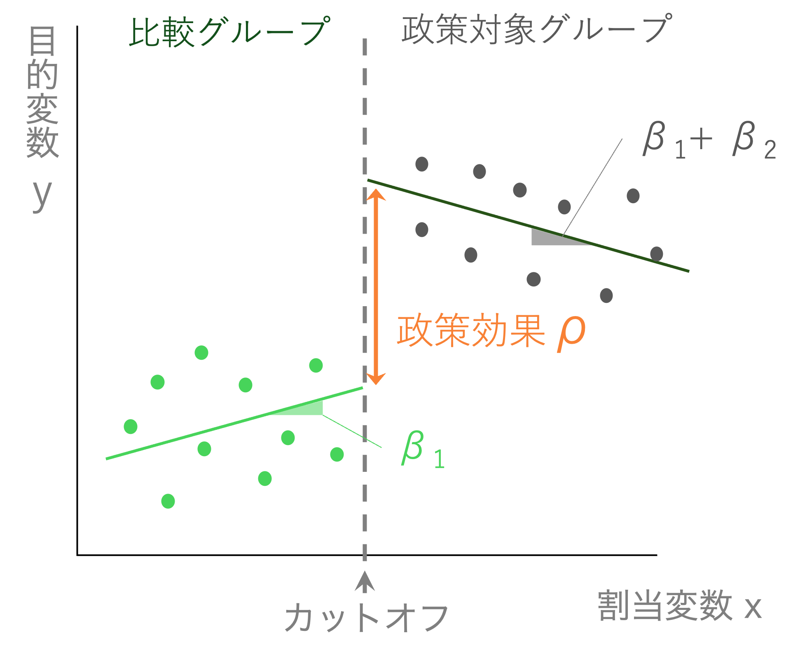

```{r setup, include=FALSE}
knitr::opts_chunk$set(echo = TRUE, warning = FALSE, message = FALSE,
                      fig.height = 3, fig.width = 7)
pacman::p_load(tidyverse, fixest)

data_rdd <- read_csv("data/data_rdd.csv") |>
  mutate(dummy70 = ifelse(age >= 70, 1, 0))
```

## 今日の内容

1. DiDの限界と別の疑似実験アプローチ
2. **回帰不連続デザイン（RDD）**のアイデア
3. 割当変数とカットオフ
4. RDDの3つの仮定
5. **回帰分析**によるRDD推定
6. 事例：医療費自己負担割合と外来受診（Shigeoka, 2014）
7. まとめ：RDDの活用

# 回帰不連続デザインのアイデア

## DiDの限界

差の差法（DiD）は**処置群と対照群**の存在を前提とする。

しかし…

**DiDが使えない場面**

- 政策が特定の閾値（点数・年齢・所得）で決まる
- 処置の有無がグループではなく**連続変数の境界**で決まる

**新しいアイデア：閾値（カットオフ）を利用する**

- 閾値のすぐ上と下は「ほぼ同じ人たち」のはず
- その境界でジャンプが起きれば → **政策の効果**

## 具体例：飲酒年齢と死亡率

**問い：アルコール摂取は死亡率を高めるか？**

- 20歳未満：飲酒禁止（日本の法律）
- 20歳以上：飲酒が法的に認められる

**18〜22歳の若者はそれ以外の点では似ている**

- 19歳 → 20歳で突然健康状態が変わるわけではない
- もし20歳前後で死亡率が急上昇 → 飲酒の効果と解釈できる

| グループ | 年齢 | 役割 |
|---------|------|------|
| 対照群 | 18〜19歳 | 飲酒しない |
| 処置群 | 20〜22歳 | 飲酒する |

## 別の例：医療費自己負担と外来受診

**Shigeoka (2014) の研究**

日本の医療費自己負担割合：

| 年齢 | 自己負担割合 |
|------|------------|
| 70歳未満 | 3割 |
| **70歳以上** | **1割** |

**問い：自己負担割合が下がると受診行動や死亡率は変わるか？**

- 69歳11ヶ月と70歳0ヶ月は、健康状態はほぼ同じ
- でも自己負担が突然変わる → **カットオフの存在**

## RDDのイメージ

```{r rdd-concept, echo=FALSE, out.width="85%", fig.align="center"}

```

年齢（割当変数）に沿って目的変数は滑らかに変化するはず。
70歳で急激なジャンプ → **政策の効果**として解釈する。

# 割当変数とカットオフ

## 重要な用語

**割当変数（Running Variable）**

- 処置・政策の対象かどうかを決める連続変数
- 例：年齢、試験の点数、所得

**カットオフ（閾値）**

- 処置の有無が切り替わる境界値
- 例：70歳、80点、所得○万円

**RDDのポイント**

カットオフのすぐ上と下は**観察されない特性がほぼ同一**のため、
ランダム化実験に近い状況を作り出せる。

## RDDの3つの仮定

**仮定1：連続性（Continuity）**

政策がなければ、割当変数と目的変数の関係は滑らかに変化する。

**仮定2：カットオフ前後の同質性**

カットオフのすぐ上と下の個体は、政策以外の点でほぼ同じ。

**仮定3：カットオフ操作なし（No Manipulation）**

個人が割当変数を意図的に操作してカットオフを超えることができない。

- **悪い例**：奨学金の閾値（80点）を知っていれば、80点以上を狙って頑張る
- → カットオフ前後で「別の人」が集まってしまう

# 回帰分析によるRDD推定

## 回帰式の定式化

**分割線形回帰（Piecewise Linear Regression）**

$$
Y_i = \alpha + \rho \cdot Policy_i + \beta_1 x_i + \beta_2 Policy_i \times x_i + \varepsilon_i
$$

- $x_i$：割当変数（年齢など）
- $Policy_i$：カットオフ以上なら 1、未満なら 0
- $\rho$：**推定したい政策効果**（カットオフでのジャンプの大きさ）
- $\beta_2$：カットオフの上下で傾きが変わることを許す項

## 係数の意味

\begin{columns}
\begin{column}{0.52\textwidth}

$$Y_i = \alpha + \rho \cdot Policy_i + \beta_1 x_i + \beta_2 Policy_i \times x_i + \varepsilon_i$$

\vspace{0.3em}

\begin{tabular}{ccc}
\hline
$Policy_i$ & $x_i$の係数 & 意味 \\
\hline
0（対照群） & $\beta_1$ & カットオフ以下の傾き \\
1（処置群） & $\beta_1 + \beta_2$ & カットオフ以上の傾き \\
\hline
\end{tabular}

\vspace{0.5em}

\textbf{$\rho = 0$かつ$\beta_2 = 0$} $\rightarrow$ 政策効果なし

\textbf{$\rho \neq 0$} $\rightarrow$ カットオフでジャンプ $\rightarrow$ \textbf{政策の効果}

\end{column}
\begin{column}{0.45\textwidth}

```{r, echo=FALSE, out.width="100%"}

```

\end{column}
\end{columns}

# 事例：医療費と外来受診

## データの確認

```{r data-head, echo=FALSE}
head(data_rdd)
```

- `age`：年齢（65〜75歳）
- `visits`：外来患者数（対数）
- `death`：死亡率（対数）
- `dummy70`：70歳以上なら 1（政策変数）

## 政策による行動の変化：可視化

```{r visit-plot, echo=FALSE, fig.height=3.2}
ggplot(data_rdd, aes(x = age, y = visits, group = dummy70)) +
  geom_point(color = 'gray') +
  geom_smooth(method = 'lm', color = 'black', se = FALSE) +
  geom_vline(xintercept = 70, linetype = "dashed", color = "red") +
  labs(x = "Age", y = "Outpatient visits (log)") +
  theme_bw()
```

70歳を境に外来患者数が急増 → **処置が機能していることを確認**

## 外来受診への効果：回帰分析

$$Visits_i = \alpha + \rho \cdot Dummy70_i + \beta_1 age_i + \beta_2 Dummy70_i \times age_i + \varepsilon_i$$

```{r rdd-visit}
rdd_visit <- feols(visits ~ dummy70 + age + dummy70:age,
                   data = data_rdd)
etable(rdd_visit)
```

## 外来受診への効果：解釈

| 係数 | 推定値 | 解釈 |
|------|--------|------|
| $\rho$（dummy70） | $1.789^{***}$ | **外来受診が約179%増加** |
| $\beta_1$（age） | 正 | 年齢とともに増加するトレンド |
| $\beta_2$（交差項） | — | カットオフ上下で傾きが異なる |

自己負担割合が3割 → 1割に下がると、外来受診が大幅増加。

→ **人々の行動が変わっている**ことを確認。

## 死亡率への効果：可視化

```{r death-plot, echo=FALSE, fig.height=3.2}
ggplot(data_rdd, aes(x = age, y = death, group = dummy70)) +
  geom_point(color = 'gray') +
  geom_smooth(method = 'lm', color = 'black', se = FALSE) +
  geom_vline(xintercept = 70, linetype = "dashed", color = "red") +
  labs(x = "Age", y = "Mortality rate (log)") +
  theme_bw()
```

70歳前後で死亡率のジャンプは見られない → **政策効果がなさそう**

## 死亡率への効果：回帰分析

$$Death_i = \alpha + \rho \cdot Dummy70_i + \beta_1 age_i + \beta_2 Dummy70_i \times age_i + \varepsilon_i$$

```{r rdd-death}
rdd_death <- feols(death ~ dummy70 + age + dummy70:age,
                   data = data_rdd)
etable(rdd_death)
```

## 死亡率への効果：解釈

| 係数 | 推定値 | 解釈 |
|------|--------|------|
| $\rho$（dummy70） | $0.149$（非有意） | 死亡率への効果 **なし** |

- 外来受診は増えた（行動変化あり）
- しかし死亡率は変わらなかった

**結論**：日本の医療費自己負担割合の低下は、受診行動を変えるが、
死亡率の改善には結びつかなかった（少なくともこのモデルでは）。

# まとめ

## RDDの活用と限界

**RDDの強み**

- 閾値が「運」のように機能する → 局所的な無作為化に近い
- 平行トレンドの仮定が不要（DiDより弱い仮定）

**前提条件（仮定）**

- 割当変数の操作がないか → **密度検定（McCrary test）**で確認
- カットオフ前後で連続性が成立するか → **プラセボテスト**

**RDDの限界**

- カットオフ**付近**の個体にしか当てはまらない（局所的な効果）
- カットオフが複数あると複雑になる

## 因果推論ツールの比較

| 手法 | 解決する問題 | 必要な条件 |
|------|------------|-----------|
| 固定効果（FE） | 時間不変の交絡変数 | パネルデータ |
| 差の差法（DiD） | 共通トレンドを除いた処置効果 | 平行トレンドの仮定 |
| **回帰不連続（RDD）** | **閾値近傍での局所的な処置効果** | **閾値付近の連続性** |
| 操作変数法（IV） | 内生性・逆の因果関係 | 関連性＋除外制約 |

次章：**操作変数法（IV）**でさらに広い問題に対応する

## 本章のRコード：まとめ

```r
pacman::p_load(tidyverse, fixest)

# 政策ダミーの作成
data_rdd <- data_rdd |>
  mutate(dummy70 = ifelse(age >= 70, 1, 0))

# RDD推定（分割線形回帰）
feols(visits ~ dummy70 + age + dummy70:age, data = data_rdd)

# 可視化：カットオフ前後で別々の回帰直線
ggplot(data_rdd, aes(x = age, y = visits, group = dummy70)) +
  geom_point(color = 'gray') +
  geom_smooth(method = 'lm', color = 'black', se = FALSE) +
  geom_vline(xintercept = 70, linetype = "dashed", color = "red")
```
