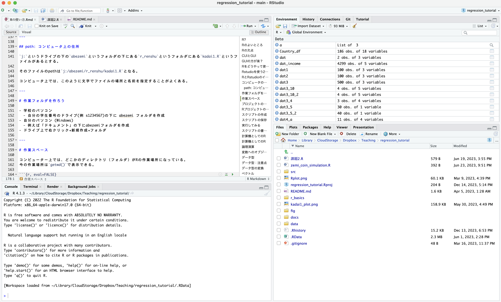
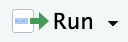

<style type="text/css">
.remark-slide-content {
    font-size: 30px;
    font-family: "メイリオ" ;
    padding: 1em 4em 1em 4em;
}
</style>


# データ分析?


---

# R?

- 　**R** は統計、データ分析、作図のためのインタープリタープログラミング言語

- 統計やデータ分析を行うアプリ
  - 他にはSPSS, Stata
  - Pythonもよく使われる
  
---

# Excelじゃだめなのか

- **Excel** は表計算ソフトで多くの機能を有している

- Excelでできること
  - 計算する
  - 図を描く
  - 基本的な統計分析

--

- じゃあExcelでよくね？

---


---

# Rのよいところ

- 無料
- 多くにプラットフォーム（MacOS, Windows, Linux)で使用可能
- たくさんの資料がネット上に存在する
- 分析結果をプレゼンテーションするツールが充実している
 - Rstudio: 統合開発環境(IDE)
- 豊富なパッケージ
  - 多くのエンジニアや研究者が公開
  

---

# 例えばRでできること：図表


---

# 例えばRでできること：ウェブアプリ

 [例](https://keita43a.shinyapps.io/easter_island/)


---

# 例えばRでできること：ウェブスクレイピング


---

# 地図の分析・活用


---

# Rの欠点

- Rは進化が早い
- 遅い
  - 一般的なデータ分析をするのには問題がない
  - Excelよりは早い
  - ビッグデータや複雑な統計モデルを走らせると、遅かったりメモリ消費が激しい
- CUIなので、最初の学習が難しい
  
---

# CUIとGUI

- CUI: Character User Interface
  - 命令を文字で行う（キーボードを使う）操作環境

- GUI: Graphic User Interface
  - マウスでクリックしながら使う操作環境

---

# GUIの方が楽？

- GUIの方が楽では？
  - マウスで操作ができる方がよさそう？

--

- CUIは記録ができる
  - 何度も同じ操作ができる
  - 人が書いた一連の操作（コード）をコピー・参考にできる
  - 柔軟性が高い

---

# プログラミング

- やることはプログラミング
--

- PythonもJavaも、まずはプログラミングを理解すると学べるようになる
- Rは比較的わかりやすい言語
--

- ゼミでは基本的なデータ描画と統計解析をできるようになることが目標


---

# Rをどうやって使う？

- Rを使うにはいくつか方法がある。
- 統合開発環境 IDE: Integrated Development Environment
  - ソフトウェア開発や、データ分析のプロセスをワンストップで行える環境
 - 一部GUIを導入したり、CUIによる操作をアシストする
- 特に強い好みがない限り、**Rstudio**をおすすめ


---

# Rstudioを使う2つの方法


1. posit.Cloudの無料プランを使う
  - クラウド上でRstudiを使う
  - コンピューター上の設定が不要
  - ファイルをアップロードして使う

2. PCにインストール
  - 自分のPCにインストール
  - ネット環境がなくても使える
  - 自分のPCにファイルにアクセスして使える

---

# RとRstudioのインストール

- 学校のパソコンにはすでにインストールされている
- 自分のパソコンに導入する人は[このスライド](https://speakerdeck.com/s_uryu/introduction-to-r)か[ここ](https://yukiyanai.github.io/jp/resources/)にある「RとRStudioのインストール方法の解説」を参照


---

# Rstudioのインターフェース



---

# Rstudioのインターフェース


---

# コンピュータのディレクトリ構造


---

## path: コンピュータ上の住所

`j:`というドライブの下の`abezemi`というフォルダの下にある`r_renshu`というフォルダにある`kadai1.R`というファイルがあるとする。

そのファイルのpathは`j:/abezemi/r_renshu/kadai1.R`となる。

コンピュータ上では、このように文字でファイルの場所と名前を指定することがよくある。

---

# 作業フォルダを作ろう

- 学校のパソコン
  - 自分の学生番号のドライブ(例 s1234567)の下に abezemi フォルダを作成
- 自分のパソコン (Windows)
  - 例えば「ドキュメント」の下にabezemiフォルダを作成
- ドライブ上で右クリック→新規作成→フォルダ

---

# 作業スペース

コンピューター上では、どこかのディレクトリ（フォルダ）がRの作業場所になっている。
今の作業場所は`getwd()`で表示できる。


```r
getwd()
```

これを変更するには`setwd(path)`で変更できる。


```r
setwd("j:/abezemi")
```

ここでは`j:`ドライブの下の`abezemi`フォルダに設定。
もう一度`getwd()`して変更されたか確認しよう。

---

# プロジェクトの作成

作業場所を指定しても、ファイルの管理が面倒だったりする。

RStudioのRプロジェクトという機能を使うと、以下のメリットがある

- データやスクリプト（コード）へのアクセスが容易
- Git によるバージョン管理のベースにもなる
- 異なる環境でも同じ作業スペースが設定される

---

# Rプロジェクトの作成

- File -> "New Project"
  -もしくは右上の "Project (none)"

- New Directoryでプロジェクトを作成

- "New Project"を選択

- プロジェクト名を入力: r_renshu 
 - 英語で。日本語は使えない（もしくはトラブルの元になる）
 
---

# Rプロジェクトの作成

- プロジェクトが作成されると、作成したディレクトリにはプロジェクト名.Rprojという名前のファイルが作成される
 - 今回はr_renshu.Rproj
- プロジェクトの設定などを保存

---

# スクリプトの作成

Rとの"対話"は、Rstudioの左下のペイン(Console)で行われる。
そのままConsoleに入力しても機能するが、**スクリプト**(コード)に書くことで、記録を残しながらRに命令を与えることができる。

**作成**
- File -> New File -> R script
- もしくは左上の区画のから、「R Script」


---

# スクリプトの保存

Rスクリプトは.Rで終わるファイルとして保存される (例：kadai1.R)

**保存**
- File -> Save -> 名前をつける
- もしくはフロッピーのアイコン


---

# 実行してみる

R scriptに以下のように書く


```r
print("Hello World!")
```

```
## [1] "Hello World!"
```

カーソルが同じ行にあることを確認して、をクリック  
もしくは、[Ctrl]を押しながら[Enter] (MacならCommand+Enter)

"Hello World!"と表示されれば成功。

---

# スクリプトの書く際の注意点

R script上では\#から始まる行は、コメントとして認識され、実行するとコンソールには表示されるが、何も起こらない。  
メモなどを書く際に使う。


```r
# これは初めてのRのコードです。
print("Hello World")
```

```
## [1] "Hello World"
```

もしくは一度使ったが、今は実行したくないコードを一時的に無効にする（コメントアウト）


```r
# print("Good Evening")
```

---

# スクリプトは読みやすく

コメントや改行を活用して読みやすいコード（スクリプト）を書く。
Rのコードでは空行は意味をなさないのでいくらでも空けてよい。


```r
# Rの練習１
# 2024年4月15日

# ------ ライブラリ ---------
library(tidyverse)

# ------ コード本体 ---------
# はじめまして
print("Hello World!")

# 足し算
x <- 1 + 1

# データを読み込む
# このデータはXXでダウンロードした
data <- read_csv("data/data1.csv")
```

---

# スクリプトは読みやすく

よくない例


```r
library(tidyverse)
print("Hello World!")
x <- 1 + 1
data <- read_csv("data/data1.csv")
```

---

# エラーを恐れるな！

- 間違ったコマンドを入力すると赤字でエラーが出る。
- 怖がらなくてよい。間違ってると教えてくれてるだけ。
- .(ドット)と,(コンマ)を間違えただけでもうまくいかないのがプログラミング。注意深く書こう。


```r
# これは間違ったコード(tを忘れてる)
prin("Hello World")
```

```
## Error in prin("Hello World"): could not find function "prin"
```

---

# よくあるエラー1

`Error in read_csv("data/Countries.csv") :
could not find function "read_csv"`

`XXX`という関数が見つかりません、というエラー

**考えられるケース**

- `library()`で必要なパッケージを読み込めてない
- 関数のつづりが間違っている

---

# よくあるエラー2


`Error: 'data/Countris.csv' does not exist in current working directory`

XXX.csvというファイルが作業場所にありません。

**考えられるケース**
- そもそもファイルがない（保存した場所を間違えた）
- ファイルの指定場所が間違っている
- つづりが間違っている

---


# Rstudioの補完機能

オブジェクト内の要素や、ファイル名などを補完してくれる機能


---

# Rstudioのオプション

Rstudioを自分好みにカスタマイズすることが可能  
[Tools]->[Global Options...]

- Rstudio全般
- コーディング
- 外観
- ターミナル
- キーボードショートカット

---

# Rstudioのオプション

例えば外観の変更


---

# 計算機としてのR:足し算、掛け算


```r
# 足し算
1 + 1
```

```
## [1] 2
```


```r
#掛け算は * 
2 * 3
```

```
## [1] 6
```

---

# 計算機としてのR：割り算


```r
# 割り算は /
(2+7)/3
```

```
## [1] 3
```


```r
# 割り切れない場合はある程度まで桁が表示
10/3
```

```
## [1] 3.333333
```

---

# 練習問題：以下の演算をRでやってみよう

1. $3978\div67$
2. $(256\times 43 + 54)\div 8$
3. $1 + 2 + 3 + 4 + 5 + 6 + 7 + 8 + 9 + 10 + 11 + 12$

---


```r
# 1
9179/67
```

```
## [1] 137
```

```r
# 2
(256*43+54)/8
```

```
## [1] 1382.75
```

```r
# 3
1 + 2 + 3 + 4 + 5 + 6 + 7 + 8 + 9 + 10 + 11 + 12
```

```
## [1] 78
```


---

# 論理演算

書いてあることが真か偽か？


```r
# 「10は5より大きい」という命題は正しい？
10 > 5
```

```
## [1] TRUE
```


```r
# 「等しい」は=が2つ == 
"musashi" == "musashi"
```

```
## [1] TRUE
```


```r
"musashi" == "634"
```

```
## [1] FALSE
```


---

# 変数へのオブジェクトの代入


```r
# x や yという「入れ物」に数字を代入
x <- 8
y <- 3

z <- x + y
z
```

```
## [1] 11
```

---

# プログラミング：繰り返し


```r
for(i in 1:10){
  print(i+1)
}
```

```
## [1] 2
## [1] 3
## [1] 4
## [1] 5
## [1] 6
## [1] 7
## [1] 8
## [1] 9
## [1] 10
## [1] 11
```


---

### **練習問題**：ループを用いた計算

1から50までを合計する繰り返し文を書いてみよう。

$1+2+3+\cdots+50=$

ヒント：まず`goukei`というオブジェクトを用意して0を入れてみよう。

---

### **練習問題**：ループを用いた計算


```r
# まずgoukeiに0を入れる
goukei = 0

for(i in 1:50){
  goukei = goukei + i
}

print(goukei)
```

```
## [1] 1275
```

---

# プログラミング：if文

もしある命題が真ならどうする、偽ならどうするというifの条件によって異なる処理を行うif文もプログラミングの基本だ。Rでも簡単に実装できる。


```r
x <- 5

# もしxが0より大きいなら、yに3+xを代入するという処理を実行する。
if(x > 0){
  y = 3 + x
}

print(y)
```

```
## [1] 8
```


---

# プログラミング：if文

命題が偽の場合


```r
x <- -4

# もしxが0より大きいなら、wに3+xを代入するという処理を実行する。
if(x > 0){
  w = 3 + x
}

# 上の処理は実行されていないのでwは定義されず、"not found"というエラーが出る。
print(w)
```

```
## Error in print(w): object 'w' not found
```


---

# プログラミング：if文

もし命題が偽だった場合の処理も指定できる。


```r
x <- -5

# もしxが0より大きければ3を足してvに代入、
# そうでなければ3を引いてvに代入。
if(x > 0){
  v = x + 3
}else{
  v = x - 3
}

print(v)
```

```
## [1] -8
```

---

# データ型

Rのオブジェクトにはいくつかの「型」がある


```r
# 実数
x <- 634
mode(x)
```

```
## [1] "numeric"
```


```r
# 文字列
y <- "musashi"
mode(y)
```

```
## [1] "character"
```

---

# データ型：注意点

数字であっても文字列として扱われていると、計算ができない


```r
# 数字だが文字列
z <- "634"
mode(z)
```

```
## [1] "character"
```


```r
z + 6
```

```
## Error in z + 6: non-numeric argument to binary operator
```

---

# データ型の変換


```r
# データ型のチェック
mode(z)
```

```
## [1] "character"
```

```r
# 実数かどうか？
is.numeric(z)
```

```
## [1] FALSE
```


```r
# データ型を実数に変換して再度zに代入
z <- as.numeric(z)
# 再度チェック
is.numeric(z)
```

```
## [1] TRUE
```

---

# ベクトル

順序のある要素の集まりをベクトルと呼ぶ。
`c()`関数で作成することができる。


```r
v1 <- c(1,2,3,4,5)
print(v1)
```

```
## [1] 1 2 3 4 5
```

ベクトルは、文字や論理値など取ることができる。


```r
v2 <- c("musashi","nerima","ekoda")
print(v2)
```

```
## [1] "musashi" "nerima"  "ekoda"
```


```r
v3 <- c(FALSE,TRUE,TRUE,FALSE)
print(v3)
```

```
## [1] FALSE  TRUE  TRUE FALSE
```


---

# ベクトルの型

異なるデータ型を同じベクトルに混ぜることはできない。
混ぜると、一定のルールに基づいてある型が他の型より優先される


```r
# 数値と論理値を混ぜると、数値になる。(FALSE->0, TRUE->1)
v4 <- c(FALSE,1,TRUE)
print(v4) 
```

```
## [1] 0 1 1
```


```r
# 数値と論理値と文字列を混ぜると、全部文字列になる

v5 <- c(FALSE,1,"musashi")
print(v5)
```

```
## [1] "FALSE"   "1"       "musashi"
```

---

# ベクトル：連続した数値

連続した数値を入力したい場合はコロン`:`を使う


```r
v6 <- c(1:10)
print(v6)
```

```
##  [1]  1  2  3  4  5  6  7  8  9 10
```

nずつ増える数列を作りたい場合は、`seq()`関数を使う


```r
# 例：2から50まで２ずつ増える数列
v7 <- seq(2,50,by=2)
```

---

# ベクトル：連続した数値

**練習問題**：3から60まで3ずつ増える数列ベクトルを作りなさい

--


```r
# 3から60まで3ずつ増える数列
v7_ex <- seq(3,60,by=3)

print(v7_ex)
```

```
##  [1]  3  6  9 12 15 18 21 24 27 30 33 36 39 42 45 48 51 54 57 60
```

---

# ベクトル：連続した数値

同じ数値がたくさんあるベクトルを作りたい場合は`rep()`関数を使う


```r
# 5が100個ならぶベクトル
v8 <- rep(5,100)
print(v8)
```

```
##   [1] 5 5 5 5 5 5 5 5 5 5 5 5 5 5 5 5 5 5 5 5 5 5 5 5 5 5 5 5 5 5 5 5 5 5 5 5
##  [37] 5 5 5 5 5 5 5 5 5 5 5 5 5 5 5 5 5 5 5 5 5 5 5 5 5 5 5 5 5 5 5 5 5 5 5 5
##  [73] 5 5 5 5 5 5 5 5 5 5 5 5 5 5 5 5 5 5 5 5 5 5 5 5 5 5 5 5
```
--

本当に100個出てるか？
ベクトルの要素の数を数える関数は`length`


```r
length(v8)
```

```
## [1] 100
```

---

# ベクトル要素の参照

ベクトルのn個目の要素を参照したいときは角カッコを使う`[]`


```r
# v7の3つ目の要素は6
v7[3]
```

```
## [1] 6
```


```r
# v7の2,3,5つ目の要素
v7[c(2,3,5)]
```

```
## [1]  4  6 10
```

---

# リスト

様々なベクトルやデータなどのオブジェクトをひとまとめにして扱うことができるのがリスト

リストは`list()`関数で作成する

---

# リスト


```r
# aというオブジェクトに、文字列ベクトル、数値ベクトル、データが混ざって入っている。
# カンマ, の後に改行しているが、listのかっこが閉じるまではひとまとまりだと扱われる。

a <- list(
  c("a", "b", NA, "d"),
  num = c(3, 1.1, 5),
  data = head(mtcars, 1))

a
```

```
## [[1]]
## [1] "a" "b" NA  "d"
## 
## $num
## [1] 3.0 1.1 5.0
## 
## $data
##           mpg cyl disp  hp drat   wt  qsec vs am gear carb
## Mazda RX4  21   6  160 110  3.9 2.62 16.46  0  1    4    4
```

---

# リストの参照

リストの参照も角カッコでできる

```r
# リストの参照
a[1]
```

```
## [[1]]
## [1] "a" "b" NA  "d"
```

```r
a[2]
```

```
## $num
## [1] 3.0 1.1 5.0
```

---

# リストの参照

リストの中身のみを取り出したい場合は、二重括角カッコを使う`[[]]`


```r
a[[3]]
```

```
##           mpg cyl disp  hp drat   wt  qsec vs am gear carb
## Mazda RX4  21   6  160 110  3.9 2.62 16.46  0  1    4    4
```


