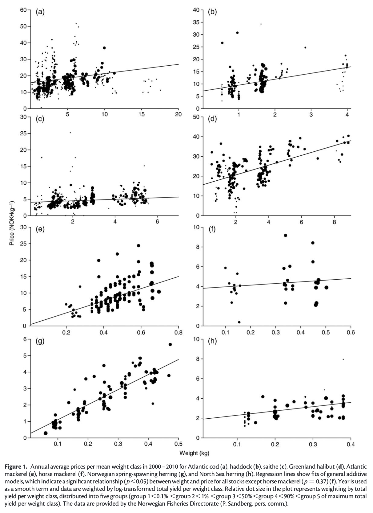

<style type="text/css">
.remark-slide-content {
    font-size: 30px;
    font-family: "メイリオ" ;
    padding: 1em 4em 1em 4em;
}
</style>

```{r setup, include=FALSE}
knitr::opts_chunk$set(echo = FALSE, warning = FALSE, message = FALSE)
pacman::p_load(
  tidyverse,
  patchwork
)
```

# 俺たちは何に興味があるのか？

- 研究や分析をするとき、何に興味があるか？

--

  - 魚のサイズは価格に影響するのか？
  - 魚の重さと魚の体長にはどのような関係があるか？
  - 漁獲の多様性は所得の安定に寄与するのか？

--

- 「関係」「影響」「効果」


---

# 関係の例

.pull-left[
- 魚のサイズと価格に関係はあるのか？

- サイズが大きいほど、単価が高い？
]

.pull-right[


]


---

# データにおける関係

```{r corr, echo=FALSE, fig.height=4,fig.width=12}
set.seed(3)
dat1 <- tibble(
  x = rnorm(100),
  y1 = 1*x + rnorm(100,sd=0.5),
  y2 = -1*x + rnorm(100,sd=0.5),
  y3 = rnorm(100,sd=1)
)

plot1 = ggplot(dat1,aes(x=x,y=y1)) +
  geom_point()

plot2 = ggplot(dat1,aes(x=x,y=y2)) +
  geom_point()

plot3 = ggplot(dat1,aes(x=x,y=y3)) +
  geom_point()

plot1+plot2+plot3

```

- $x$ と $y$ の関係は？

---

# データにおける関係

```{r reg1, echo=FALSE, fig.height=4,fig.width=12, fig.align='center'}

plot11 = ggplot(dat1,aes(x=x,y=y1)) +
  geom_point()+
  geom_smooth(method="lm",se=F)

plot12 = ggplot(dat1,aes(x=x,y=y2)) +
  geom_point()+
  geom_smooth(method="lm",se=F)

plot13 = ggplot(dat1,aes(x=x,y=y3)) +
  geom_point()+
  geom_smooth(method="lm",se=F)

plot11+plot12+plot13

```

---

# データにおける関係

- では次のような場合はどういう関係があるか？
tempdataの散布図

---

# データにおける線形的な関係

- 線形的な関係はあるか？

tempdataの線形の図  

---

# データにおける非線形的な関係

- 非線形的な関係？
  - アイデア：一時間ごとに分けて平均を取り、線でつなぐ


--

- このような手法をノンパラメトリック回帰という。

---

# なぜ回帰するのか？

- データから、事象に関係があるのか？どんな関係があるのか？を分析する
  - 「関係がある」ということを突き止める（識別）
  - 「どんな関係があるか」を突き止める（関数形の特定）
  - 「得られた関係から、データ外の事象を予測する」（予測）

---

# 関係？

- 関係とはなにか？

--

  - 高い身長の人は、体重が重い
  - 養殖場の餌の量を増やすと、魚の成長が早くなる

--

  - ゲーム時間が長いほど、学業成績が低い

--

- では、ある子供のゲーム時間を短縮させると、学業成績が向上するのだろうか？

---

# ゲームと成績の関係

- ゲームとテストの成績には_相関関係_がある

```{r, fig.align='center'}
# http://rich-iannone.github.io/DiagrammeR/graphviz_and_mermaid.html

DiagrammeR::grViz("
                  digraph wage_educ {
                  
                  graph [overlap = true, fontsize = 10, rankdir=LR]
                  
                  node [shape = circle,
                  fixedsize = true,
                  width = 0.9] 
                  ゲーム; 成績;
                  
                  
                  # edge statement
                  ゲーム->成績
                  
                  }")

```
---

# ゲームと成績の関係

- ゲームとテストの成績には_相関関係_がある

ゲームとテスト成績の相関関係散布図

---

# ゲームと成績の関係

- ゲームとテストの成績には_相関関係_がある

家庭環境を第3の因子としていれたDAG

---

# 因果関係と相関関係


---

# 社会科学における因果関係発見の難しさ

- 人々はXを与えられたらYを選ぶのではなく、様々な情報に基づいてXとYの両方を選んでいる。

