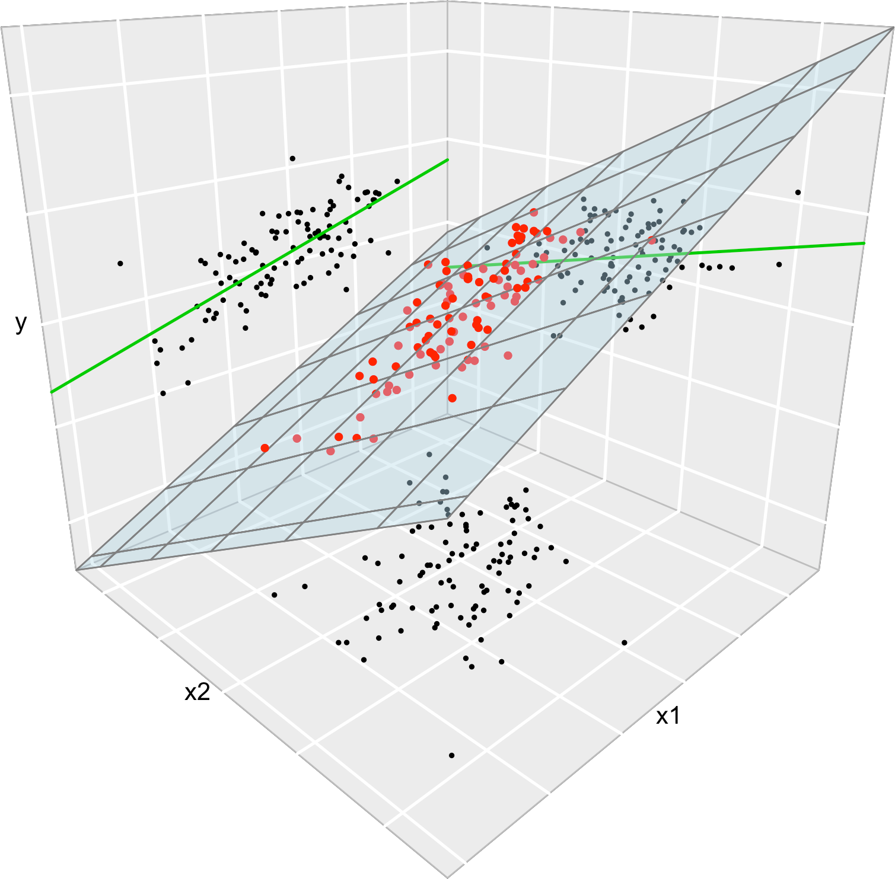

<style type="text/css">
.remark-slide-content {
    font-size: 30px;
    font-family: "メイリオ" ;
    padding: 1em 4em 1em 4em;
}
</style>

```{r setup, include=FALSE}
knitr::opts_chunk$set(echo = FALSE, warning = FALSE, message = FALSE)
pacman::p_load(
  tidyverse,
  knitr,
  kableExtra,
  patchwork,
  cols4all
)

## options(scipen=999)
```

# 単回帰モデル

データを用いて推定する（観測番号がつく）

$$
 Y_i = \beta_0 + \beta_1 X_i + U_i
$$

$\beta_0,\beta_1$ : 回帰パラメター  
$Y$ ：被説明変数/従属変数  
$X$ ：説明変数/独立変数  


---

# 外的条件が揃っていない場合

外的条件 $C$ が揃っていない場合、確率変数 $C$ が取りうる値 $c$ を使って揃える。

$$
  E[Y|X=1, C=c] - E[Y|X=0, C=c]
$$

政策を示す変数(政策変数)と成果を示す変数(成果変数)の関係のみをモデル化するものが**単回帰分析**。外的条件を共変量で制御しながら因果効果を探る回帰分析を**重回帰分析**と呼ぶ。


---

# 回帰分析

**回帰分析**は、成果変数の期待値 $E[Y|X]$ を説明変数の関数として**モデル化**

$$
 E[Y|X,C] = f(X,C)
$$

---

# 外的条件

単回帰モデルを推定するときに、 $E[U|X]=E[U]$ が成り立っているのか？

**例**：

- 朝ごはんを食べることがテストの点数に効果を与えるのか？
- 家庭の所得という外的条件
  - どういう可能性があるか？

---

# 回帰分析：重回帰モデル

単回帰モデルは、政策変数の実現値で条件付けした成果変数の期待値を次のようにモデル化する

$$
  E[Y|X,C] = \beta_0 + \beta_1 X + \beta_2 C
$$

誤差項をつけた重回帰モデル（母集団モデル）

$$
 Y = \beta_0 + \beta_1 X + \beta_2 C + U
$$

---

# 重回帰モデル

重回帰モデルは変数が一つと限らない

$$
  Y = \beta_0 + \beta_1 X_1 + \beta_2 X_2 + \ldots + \beta_k X_k+ U
$$

---

# Ceteris Paribus

社会は複雑→様々な条件が、入り組んでいる

外的条件を揃えることで、興味のある変数の効果を見る

**Ceteris paribus**: 「他の条件を一定として」


---

# 例6.1 ミンサー方程式

教育の収益率：就学年数を伸ばすことによる所得の増加率

$$
 \ln賃金_i = \beta_0 + \beta_1 修学年数_i + U_i
$$
--

高卒20年のベテランと大卒1年目を比較したらどちらの賃金が高いか？

$$
 \ln賃金_i = \beta_0 + \beta_1 修学年数_i + \beta_2 就業可能年数_i + \beta_3 就業可能年数_i^2 + U_i
$$

---

# 重回帰分析のイメージ

```{r,results='asis',out.width="400px"}

```


---

# 重回帰分析の推定

モーメント条件（もしくは最小化問題の1階条件）は $k+1$ 本の方程式

$$
 E[X_1U]=0, E[X_2U]=0,\ldots,E[X_kU]=0,E[U]=0
$$

---

### 例6.2：教育の収益率の推定

```{r,echo=TRUE}

dat_income = read_csv("../data/tanaka_data/csv/6_1_income.csv")
rei6.2 = lm(lincome ~ yeduc + exper + exper2,dat_income); summary(rei6.2)

```

---

# 自由度調整済み決定係数

決定係数 $R$ : $X$ の数が多いと、 $R$ が大きくなる

$$
 R^2 = 1- \frac{\sum \hat{u}_i}{\sum (y_i - \bar{y})^2}
$$


**自由度調整済み決定係数**: 説明変数を増やすだけでは $R^2_a$ は小さくなる

$$
 R^2_a = \frac{(1-R^2)(n-1)}{n-k-1}
$$

---
 
### 例6.3 教育の収益率の推定における $R^2$ と $R^2_a$

```{r}
summary(rei6.2)
```


---

# 不偏性のための4つの仮定

1. **真のモデル** : 母集団分布において、確率変数 $(Y,X_1,\cdots,X_k,U)$ の間には次のような関係がある: $Y=\beta_0 + \beta_1X_1+\cdots+\beta_kX_k+U$

2. **無作為抽出** : 母集団から標本サイズ $n$ の無作為抽出標本 $\{(x_{1i},\ldots,x_{ki},y_i)\}$が得られる

3. **平均独立** : $E[U|X_1,\ldots,X_k] = 0$

4. **識別条件** : 説明 $X$ に変動があり、完全な*共線関係*がない

---

# 共線関係

ある説明変数が別の説明変数を完全に決定してしまう関係

- 男性ダミー変数 (男=1, 女性=0)と、女性ダミー変数（男=0, 女=1)
- ある変数のa倍

**多重共線性** (Multicollinearity)

説明変数同士の相関が高すぎると、うまくパラメターを推定できない問題

- 船の長さと船のトン数

---

# 欠落変数バイアス

真のモデルが

$$
 Y=\beta_0 + \beta_1X + \beta_2C + U
$$

なのに、単回帰モデルを推定してしまったら？

$$
  Y=\beta_0 + \beta_1X + V
$$

---

# 欠落変数バイアス (2)

この時、誤差項に見える $V$ は実は $V=\beta_2C+U$

外的条件 $C$ と $X$ は関係があるので

$$
 C=\gamma_0 + \gamma_1X+U_c
$$
というモデルでは、 $\gamma_1$ はゼロではない数値となる

例：朝ごはんを食べる家庭 $X$ ほど、 家庭所得が高い $C$

---

# 欠落変数バイアス (3)

最小二乗推定量は、

$$
 \hat{\beta_1} = \frac{\frac{1}{n}\sum(x_i-\bar{x})(y_i-\bar{y})}{\frac{1}{n}\sum(x_i-\bar{x})^2}
$$

だが、真のモデルは $Y=\beta_0 + \beta_1X + \beta_2C + U$  なので、代入してして期待値を取ると

$$
 E[\hat{\beta}_1] = \beta_1 + \beta_2\gamma_1
$$

つまりどういうことか？

---

### 例6.4 親の教育水準が子供の就学年数に与える影響

```{r}
dat6_2_yeduc = read_csv("../data/tanaka_data/csv/6_2_yeduc.csv")
```

```{r,echo=TRUE}
rei6.4.1 = lm(yeduc~mocograd,dat6_2_yeduc); summary(rei6.4.1 )
```

---

### 例6.4 親の教育水準が子供の就学年数に与える影響 (2)


```{r,echo=TRUE}
rei6.4.2 = lm(yeduc~mocograd+pacograd,dat6_2_yeduc); summary(rei6.4.2)
```

---

```{r,echo=TRUE}

modelsummary::msummary(list(rei6.4.1,rei6.4.2), statistic =NULL,
                       gof_omit = 'Log.Lik.|AIC|BIC|F')

```

---

```{r,echo=TRUE}

cor(dat6_2_yeduc)

```

---

# 分散均一の仮定


.pull-left[

```{r,fig.height=5}
dat3 <- tibble(
  x = runif(500,0,100),
  y = 5 + 2*x + rnorm(100,0,15),
  y2 = 5 + 2*x + rnorm(100,0,15)*(x/50)
)

ggplot(dat3,aes(x=x,y=y)) + 
  geom_point(size=2) + 
  geom_smooth(method="lm",se=FALSE) +
  labs(title="分散均一") + 
  theme_bw(base_family="HiraKakuPro-W3") +
  theme(text = element_text(size=20))
```


]

.pull-right[

```{r,fig.height=5}
ggplot(dat3,aes(x=x,y=y2)) + 
  geom_point(size=2) + 
  geom_smooth(method="lm",se=FALSE) +
  labs(title="分散不均一") + 
  theme_bw(base_family="HiraKakuPro-W3") +
  theme(text = element_text(size=20))
```


]


---

# 分散均一性の仮定

Xに関わらず分散が誤差項の分散が一定と仮定する

$$
 V[U|X_1,\ldots,X_k] = V[U] = s^2
$$

---

# 最小二乗推定量の分散

 $j$ 番目の変数の係数の推定量


$$
 V[\hat{\beta_j}|x_{11},\ldots,x_{k1},\ldots,x_{1n},\ldots,x_{kn}]=\frac{s^2}{\sum (x_{ji}-\bar{x}_j)^2(1-R_j^2)}
$$

 $R_j^2$ は $X_j$ をその他すべての説明変数と切片で回帰したときの決定係数
 
$$
 X_j = \gamma_0 + \gamma_1 X_1 + \cdots + \gamma_{j-1} X_{j-1}+\gamma_{j+1} X_{j+1} + \cdots + \gamma_{k}X_{k} +U_{j}
$$

今は「そういうもの」という理解でよい。
問題は、どういう構造をしていてどういう関係があるか？

---

# 最小二乗推定量の分散 (2)

- 誤差分散 $s^2$ が大きいと、推定量の分散も大きくなる

- $x_j$ の総変動が大きいと、分散が小さくなる

- 決定係数 $R_j$ が大きいと、分散が大きくなる
  - 完全共線関係だと、分母がゼロ→分散が無限？
  - 多重共線性があると、分散が非常に大きくなる
  
---

# 最小二乗推定量の分散 (3)

誤差項の分散 $s^2$ は単回帰と同様に残差を推定値として推定する

$$
 \hat{s}^2 = \frac{1}{n-k-1}\sum\hat{u}^2_i
$$

$$
\frac{1}{n-k-1}\sum(y_i - \hat{\beta}_0 - \hat{\beta}_1 x_{1i}-\cdots-\hat{\beta}_k x_{ki})^2
$$

---

# OLS is BLUE

最小二乗法(OLS: Ordinary Least Square)はBLUE

**B**est **L**inear **U**nbiased **E**stimator

つまり最良線形不偏推定量

最良とは最も効率的であるということ。

不偏性の4つの仮定と、誤差項均一の仮定が満たされていれば、回帰分析の中で最も効率的な線形の推定量であることが、ガウス=マルコフ定理という定理で証明されている

---

# 検定

推定はできるが、実際に推定された数値が統計的にどれほど信頼できるのか？

**仮説検定**を行って、推定されたパラメターを評価する

---

# 回帰パラメターの仮説検定

例：「朝ごはんを食べることはテストの点数に効果がない」という**帰無仮説**を建てる

$$
 Y=\beta_0 + \beta_1X+\beta_2C+U
$$

$$
 H_0: \beta_1 = 0
$$


この帰無仮説の下で、 $\hat{\beta_1}$ が得られる確率が有意水準より低ければ、「効果がない」という仮説を棄却して、対立仮説である「効果がある」という結論を採択する

---

# パラメターの分布

パラメーターがどういう分布にしたがっているかを知る必要

ここで「誤差項が正規分布にしたがっている」という仮定を追加

$$
 U \sim N(0,s^2)
$$
すると、データで条件付けられた被説明変数 $Y$ も正規分布に従う

$$
 Y|x \sim N(E[Y|x], s^2)
$$
$$
 = N(\beta_0 + \beta_1x_1+\ldots+\beta_kx_k, s^2)
$$

---

# パラメターの分布

最小二乗推定量は


$$
 \hat{\beta_1} = \sum\frac{\frac{1}{n}(x_i-\bar{x})}{\frac{1}{n}\sum(x_i-\bar{x})^2}(y_i-\bar{y}) = \sum w_i(y_i-\bar{y})
$$

つまり、 $y$ の変動の加重平均であるので、 $\hat{\beta_1}$ もまた正規分布に従う。（というのが直感的説明)

$$
 \hat{\beta}_1 \sim N(\beta_1, V[\hat{\beta}_1])
$$

---

# 標準化

パラメターの推定値を標準化することで、標準正規分布に変換し、検定を行うことができる

$$
 \frac{\hat{\beta}_1-\beta_1}{\sqrt{V[\hat{\beta}_1]}} \sim N(0,1)
$$
--
できる？本当に？

---

# 標準誤差

標準偏差(分散のルート)は分散がわからないので、未知

--

残差の分散から計算される標準誤差を使う

$$
 \frac{\hat{\beta}_1-\beta_1}{se(\hat{\beta}_1)}
$$
---

# t分布

帰無仮説 ( $\beta_1 = 0$ )の下での検定では、以下の推定量（**統計検定量**) が用いられる。この検定量は自由度が $n-k-1$ のt分布に従う

$$
  \frac{\hat{\beta}_1}{se(\hat{\beta}_1)} \sim t(n-k-1)
$$

---

# 古典的線形モデルの仮定

- 不偏性の4つの仮定

- 分散均一性の仮定

- 誤差項の正規性の仮定


---

### 例6.6 t検定

```{r}
summary(rei6.2)
```

---

# 複合仮説検定

一つ一つのパラメターは、t検定で検定できる（実際にはRなどがやってくれる）

複数のパラメターを同時に検定する場合は？

$$
 Y=\beta_0 + \beta_1X + \beta_2C_1 + \beta_3C_2 + U
$$

---

# 複合仮説検定 (2)

「家計所得 $C_1$ と母親の学歴 $C_2$ はともにテストの点数に寄与しない」

$$
 H_0 : \beta_2 = \beta_3 = 0
$$

対立仮説は

$$
 H_1 : \beta_2 \neq 0 または \beta_3 \neq 0
$$

---

# 複合仮説検定 (3)

考え方としては帰無仮説が真とした場合のモデル(R)と、元のモデル(UR)を比較すること

もし帰無仮説が真ならばモデル(R)は

$$
 Y = \beta_0 + \beta_1 X_i + U
$$
元のモデル(UR)は

$$
 Y = \beta_0 + \beta_1 X_i + \beta_2C_1 + \beta_3C_2 + U
$$
---

# 複合仮説検定 (4)

帰無仮説の下でのRモデルとURモデルの残差二乗和(SSR)の差に基づく統計量が、F分布に従うという性質を利用したものがF検定

$$
 \frac{(SSR_r-SSR_u)/q}{(SSR_r)/(n-k-1)} \sim F(q,n-k-1)
$$

---

# 例6.7 複合仮説検定

```{r}
car::linearHypothesis(rei6.2, c("exper=0","exper2 = 0"))
```

---

# 大標本理論

**一致性** : $\hat{\theta}_n \rightarrow_p \theta$

不偏性のための仮定よりも弱い仮定で一致性を持つことが証明できる


---

# 確認問題 6-1

微分してゼロと置く


---

# 実証分析 6-A

例6.2.と同じ


---

### 実証分析 6-B (1)

```{r,echo=TRUE}
ex6_B = lm(mocograd ~ pacograd, data=dat6_2_yeduc); summary(ex6_B)
```

---

### 実証分析 6-B (1)

残差をデータに統合

```{r,echo=TRUE}
dat6_2_yeduc$res = residuals(ex6_B)
```

---
### 実証分析 6-B (2)

```{r,echo=TRUE}
ex6_B_2 = lm(yeduc ~ res, data=dat6_2_yeduc); summary(ex6_B_2)
```

---

### 実証分析 6-B (2)


```{r,echo=TRUE}
summary(rei6.4.2)
```


---

### 実証分析 6-C (1)

```{r}
dat6_3_happy_work = read_csv("../data/tanaka_data/csv/6_3_happy_work.csv")
```


```{r,echo=TRUE}
ex6_C = lm(happy_work ~ commute,dat6_3_happy_work); summary(ex6_C)

```

---

### 実証分析 6-C (2)

```{r,echo=TRUE}
ex6_C_2 = lm(happy_work ~ commute + income + yeduc,dat6_3_happy_work); summary(ex6_C_2)

```

---

### 実証分析 6-C (3)

```{r,echo=TRUE}
car::linearHypothesis(ex6_C_2, c("income=0","yeduc=0"))

```


---

### 実証分析 6-D (1)

```{r}
dat6_4_minshu = read_csv("../data/tanaka_data/csv/6_4_minshu.csv")
```

```{r,echo=TRUE}

ex6_D = lm(minshu ~ income,dat6_4_minshu); summary(ex6_D)

```
---

### 実証分析 6-D (2)

```{r,echo=TRUE}

ex6_D_2 = lm(minshu ~ income + yeduc,dat6_4_minshu); summary(ex6_D_2)

```
